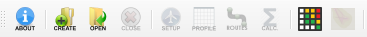

# OpenALAQS

<!-- Add buttons here -->

<!-- Describe your project in brief -->

<!-- The project title should be self explanotory and try not to make it a mouthful. (Although exceptions exist- **awesome-readme-writing-guide-for-open-source-projects** - would have been a cool name)

Add a cover/banner image for your README. **Why?** Because it easily **grabs people's attention** and it **looks cool**(*duh!obviously!*).

The best dimensions for the banner is **1280x650px**. You could also use this for social preview of your repo.

I personally use [**Canva**](https://www.canva.com/) for creating the banner images. All the basic stuff is **free**(*you won't need the pro version in most cases*).

There are endless badges that you could use in your projects. And they do depend on the project. Some of the ones that I commonly use in every projects are given below.

I use [**Shields IO**](https://shields.io/) for making badges. It is a simple and easy to use tool that you can use for almost all your badge cravings. -->

<!-- Some badges that you could use -->

<!-- 
: This badge shows the version of the current release.


: I think it is self-explanatory. This gives people an idea about how the project is being maintained.


: This is a dynamic badge from [**Shields IO**](https://shields.io/) that tracks issues in your project and gets updated automatically. It gives the user an idea about the issues and they can just click the badge to view the issues.


: This is also a dynamic badge that tracks pull requests. This notifies the maintainers of the project when a new pull request comes.

: If you are not like me and your project gets a lot of downloads(*I envy you*) then you should have a badge that shows the number of downloads! This lets others know how **Awesome** your project is and is worth contributing to.


: This shows what kind of open-source license your project uses. This is good idea as it lets people know how they can use your project for themselves.

: This is not essential but it is a cool way to let others know about your project! Clicking this button automatically opens twitter and writes a tweet about your project and link to it. All the user has to do is to click tweet. Isn't that neat? -->


## Table of contents

- [Project Title](#project-title)
  - [Table of contents](#table-of-contents)
  - [Installation](#installation)
    - [Install QGIS](#install-qgis)
    - [Install dependencies](#install-dependencies)
    - [Install OpenALAQS](#install-openalaqs)
  - [Quick start](#quick-start)
  - [Development](#development)
    - [Debugging](#debugging)
    - [Updating the OpenALAQS database templates](#updating-the-openalaqs-database-templates)
  - [Contribute](#contribute)
  - [License](#license)
- [Footer](#footer)


## Installation

[(Back to top)](#table-of-contents)

To use OpenALAQS you need to install QGIS, as well as a couple of Python libraries for the proper functioning of the plugin.


### Install QGIS

Download and install QGIS on your operating system following the official [QGIS documentation](https://qgis.org/download/).

If you are running on Windows, you should install via [OSGeo4W installer](https://qgis.org/resources/installation-guide/#osgeo4w-installer) following the `Advanced Install` route.


### Install dependencies

OpenALAQS is built on top of QGIS and a few external libraries that require separate installation.

You can find the list of libraries in the file `requirments.txt`.

You can either `pip install` them in the Python environment used by QGIS, or if you are using OSGeo4W installation,
please find the packages in the "Select Packages".


Now finish the setup by accepting the unmet dependencies and accepting the license agreements.

> If not installed using the OSGeo4W Network Installer, please uninstall the old version and install the new version using the OSGeo4W Network Installer or follow the installation guide from QGIS.

<details>
<summary>OSGeo4W installation</summary>

Find and install those packages:

- `qgis-ltr-full` (3.34.x or newer)
- `python3-geopandas` (2.x.x)
- `python3-geographiclib`
- `python3-pandas`
- `python3-matplotlib`
- `spatialite` (5.x.x)


Search for them in the search bar, and find them under the "Libs" sub-menu and select them such that they are not to be skipped in the installation (previously installed packages are shown as "Keep" in the "New" column). For QGIS you should select the latest version in the "Desktop" and "Libs" sub-menus.

</details>


### Install OpenALAQS

You can download OpenALAQS [latest release from GitHub](https://github.com/opengisch/open_alaqs/releases/latest), or browse [previous releases](https://github.com/opengisch/open_alaqs/releases/tag/v4.0.0).

Once you download the `.zip` file, go to QGIS, open the "Plugins", then "Manage and Install Plugins...".
In the newly opened window, select the "Install from ZIP" on the left sidebar.
Then select the recently downloaded `.zip` file and click "Install Plugin".

QGIS will automatically install your plugin in the appropriate location.

At this point the OpenALAQS toolbar is visible below the default QGIS toolbars.
If this is the case then the installation has been successful.




## Quick start

[(Back to top)](#table-of-contents)

Find an example study in the `example/LSZH` folder.

Here you can find the following files and directories:

- `./LSZH.alaqs` - the main ALAQS database, containing spatial and statistical information for a study in Zurich airport.
- `./LSZH_out.alaqs` - the processed ALAQS database, containing spatial and statistical information for a study in Zurich airport.
- `./LSZH_movements.csv` - the movements data in the study, used to generate `./LSZH_out.alaqs`.
- `./LSZH_meteo.csv` - the meteorological data in the study, used to generate `./LSZH_out.alaqs`.
- `./LSZH_AUSTAL/*` - a directory containing all files generated using OpenALAQS to be used as ALAQS input files.
- `./LSZH_AUSTAL/austal.txt` - the file containing all main input parameters except for time-dependent parameters 
- `./LSZH_AUSTAL/series.dmna` - the file containing all time-dependent parameters
- `./LSZH_AUSTAL/01/e0001.dmna` - input grid file, with information on the user-defined grid and on the corresponding data

For more detailed information on how to use ALAQS, the project files and expected outputs, read the [official documentation](TODO).


## Development

[(Back to top)](#table-of-contents)

1. Clone this repository.
2. Optionally, create a soft link between the local checkout and the QGIS plugin directory for easier developepment. (Linux instructions: `ln -s ${PWD} ${HOME}/.local/share/QGIS/QGIS3/profiles/default/python/plugins/open_alaqs/`).
3. Install [`pre-commit`](https://pre-commit.com).
4. Develop a new feature.
5. Open a PR.
6. Wait for the CI to succeed.
7. Ensure you have a PR approval from another reviewer.
8. Merge the PR.


### Debugging

Deugging can be done via [QGIS VSCode Debug plugin](https://plugins.qgis.org/plugins/debug_vs/) and [VSCode](https://code.visualstudio.com).

Sample `launch.json`:

```
{
    // Use IntelliSense to learn about possible attributes.
    // Hover to view descriptions of existing attributes.
    // For more information, visit: https://go.microsoft.com/fwlink/?linkid=830387
    "version": "0.2.0",
    "configurations": [
        {
            "name": "Python: Remote Attach",
            "type": "python",
            "request": "attach",
            "port": 5678,
            "host": "localhost",
            "pathMappings": [
                {
                    "localRoot": "${workspaceFolder}/open_alaqs",
                    "remoteRoot": "${HOME}/.local/share/QGIS/QGIS3/profiles/default/python/plugins/open_alaqs/"
                }
            ]
        }
    ]
}
```


### Updating the OpenALAQS database templates

The plugin produced `.alaqs` files are cloned from a template databases, that are in `./open_alaqs/core/templates/*.alaqs`.
The template databases are generated from SQL and CSV files in the `./open_alaqs/database` directory.
All source files (`.sql` and `.csv`) needed for the build are inside the `./open_alaqs/database/sql` and `./open_alaqs/database/data` folder.
Other scripts and files supporting the creation of the SQL and CSV files are located in `./open_alaqs/database/scripts` and `./open_alaqs/database/src`.

Copy-pastable way to generate the template databases:

```
pipenv run pip install -r requirements.txt
pipenv run python -m open_alaqs.database.generate_templates --full-recreate
```

To generate the CAEP examples, run the following command in the Python console in QGIS:

```python
from open_alaqs.database.create_caep_examples import create_caep_examples
create_caep_examples()
```

## Contribute

[(Back to top)](#table-of-contents)

OpenALAQS welcomes all contributions - code or documentation wise.


## License

[(Back to top)](#table-of-contents)

This software is published under European Union Public Licence v. 1.2. Read the [`LICENSE.md`](LICENCE.md).


# Footer

[(Back to top)](#table-of-contents)

Leave a star in GitHub, give a clap in Medium and share this guide if you found this helpful.
