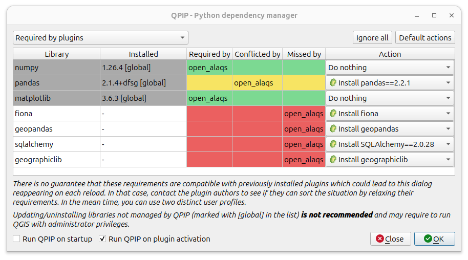
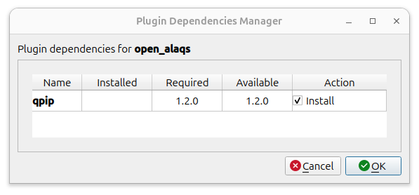

# Open-ALAQS

QGIS plugin for airport emissions inventory and dispersion. Builds an annual emissions inventory from runway, taxiway, gate, stationary, engine-test-run, and movement sources, and exports AUSTAL-ready dispersion inputs.


## Table of contents

- [Open-ALAQS](#open-alaqs)
  - [Table of contents](#table-of-contents)
  - [Installation](#installation)
    - [Install QGIS](#install-qgis)
    - [Install dependencies](#install-dependencies)
    - [Install Open-ALAQS](#install-open-alaqs)
  - [Quick start](#quick-start)
    - [Example files](#example-files)
    - [Training example study](#training-example-study)
    - [Standalone Emissions + AUSTAL Inputs export script](#standalone-emissions--austal-inputs-export-script)
  - [Workflow](#workflow)
  - [Emission calculation methods](#emission-calculation-methods)
  - [Meteorological data](#meteorological-data)
  - [GSE Application](#gse-application)
  - [Development](#development)
    - [Code style](#code-style)
    - [Debugging](#debugging)
    - [Updating the Open-ALAQS database templates](#updating-the-open-alaqs-database-templates)
    - [Unit tests](#unit-tests)
  - [Validation](#validation)
  - [Recent changes](#recent-changes)
  - [Contribute](#contribute)
  - [License](#license)
  - [Contact](#contact)

## Installation

[(Back to top)](#table-of-contents)

To use Open-ALAQS you need to install QGIS, plus a few external Python libraries the plugin depends on.

### Install QGIS

Download and install QGIS for your operating system following the official [QGIS documentation](https://qgis.org/download/).

If you are running on Windows, install via the [OSGeo4W installer](https://qgis.org/resources/installation-guide/#osgeo4w-installer) following the `Advanced Install` route.

> **Note:** If not installed using the OSGeo4W Network Installer, please uninstall any old version and install the new version using OSGeo4W or follow the QGIS installation guide. During installation, accept the unmet dependencies and license agreements.

### Install dependencies

Open-ALAQS is built on top of QGIS and a few external libraries that require separate installation. The full list is in `requirements.txt`.

**Primary method:** Use QPIP (Python Dependency Manager for QGIS Plugins) to check and install the required dependencies directly inside QGIS. See the **Install Open-ALAQS** section below for details.

**Alternative method:** Install the libraries manually using `pip install` in the Python environment used by QGIS:

```bash
pip install -r requirements.txt
```

<details>
<summary>OSGeo4W manual installation</summary>

Find and install these packages from the OSGeo4W shell:

- `qgis-ltr-full` (3.34.x or newer)
- `python3-fiona`
- `python3-geopandas` (2.x.x)

</details>

### Install Open-ALAQS

Open-ALAQS is published as a QGIS plugin. The cleanest way to install it is to clone the repository into the QGIS plugin directory for your platform:

- **Windows**: `%APPDATA%\QGIS\QGIS3\profiles\default\python\plugins\open_alaqs\`
- **macOS**: `~/Library/Application Support/QGIS/QGIS3/profiles/default/python/plugins/open_alaqs/`
- **Linux**: `~/.local/share/QGIS/QGIS3/profiles/default/python/plugins/open_alaqs/`

Then enable Open-ALAQS in the QGIS Plugin Manager (Plugins → Manage and Install Plugins → Installed → tick "Open-ALAQS").

The first time the plugin loads, QPIP will detect missing dependencies and offer to install them in the QGIS Python environment:





After dependencies are installed, restart QGIS once and Open-ALAQS will be available from the menu and toolbar:


## Quick start

[(Back to top)](#table-of-contents)

### Example files

Two example studies ship with the repository:

- `example/training/` — a self-contained study used for tutorials and validation, including pre-computed reference values to compare your run against.
- `tests/data/AIRPORT_A/` — the same study used by the regression test suite, with full pre-computed emissions tables and APU/CAEP14 comparison spreadsheets.

### Training example study

The training study lives in `example/training/` and contains:

- `training.alaqs` — the unprocessed study database (geometry, sources, study setup)
- `training_out.alaqs` — the processed inventory database (Generate Emission Inventory output)
- `training_movements.csv` — aircraft movements input
- `training_meteo.csv` — hourly meteorological input
- `training_ads_b_data.csv` — ADS-B trajectory input (used by the BFFM2 trajectory method)
- `training_validation_reference.xlsx` — reference values for verifying your installation

For a step-by-step walk-through of opening, configuring, and running a study, see the [User Guide](documents/USER_GUIDE.md).

### Standalone Emissions + AUSTAL Inputs export script

Two standalone paths to run Open-ALAQS outside the QGIS plugin are shipped:

**QGIS-bound CLIs** (`scripts/`). Use the plugin's libraries directly under an OSGeo4W shell or QGIS Python:

- [`scripts/emissions_austal/run_emissions_austal.py`](scripts/emissions_austal/run_emissions_austal.py) runs the full emissions calculation against a `.alaqs` inventory and optionally generates AUSTAL inputs in one pass. See [`scripts/emissions_austal/README.md`](scripts/emissions_austal/README.md).
- [`scripts/austal_from_csv/run_austal_from_csv.py`](scripts/austal_from_csv/run_austal_from_csv.py) generates AUSTAL inputs from pre-computed emissions / meteo CSVs (no `.alaqs` required). See [`scripts/austal_from_csv/README.md`](scripts/austal_from_csv/README.md).
- [`scripts/metar_to_alaqs_meteo.py`](scripts/metar_to_alaqs_meteo.py) converts METAR observations into the `meteo.csv` format (see [`scripts/README_metar_to_alaqs_meteo.md`](scripts/README_metar_to_alaqs_meteo.md)).
- [`scripts/migrate_alaqs.py`](scripts/migrate_alaqs.py) is the schema migration tool for upgrading legacy `.alaqs` files; [`scripts/migrate_alaqs_gui.py`](scripts/migrate_alaqs_gui.py) is the Qt GUI wrapper.

**QGIS-free package** (`openalaqs_standalone/`). A pip-installable Python package that runs the full emission calculation without QGIS, PyQt5, or SpatiaLite at runtime. Uses pyproj + shapely + numpy. Designed for headless / CI / cluster use and for batched validation against the CAEP14 reference.

- Package: [`openalaqs_standalone/`](openalaqs_standalone/) (see its [README](openalaqs_standalone/README.md))
- AUSTAL writer helpers used by the standalone live in [`austal_prep/`](austal_prep/)
- Validation: [`openalaqs_standalone/validation/tools/CAEP14_VALIDATION.md`](openalaqs_standalone/validation/tools/CAEP14_VALIDATION.md) and the bundled `training_v3.alaqs` fixture.
- Optional Reference A NOx ambient correction: `--apply-nox-corrections` (default off; preserves bymode bit-identity with the plugin).

See [`scripts/README.md`](scripts/README.md) for the full inventory of QGIS-bound CLIs.

## Workflow

[(Back to top)](#table-of-contents)

1. Build the airport study (runways, taxiways, gates, stationary sources) in a QGIS project.
2. Open *Create Output* to bake the study into an inventory database, supplying a movements CSV and a meteorological CSV (see [Meteorological data](#meteorological-data)).
3. Run *Generate Emission Inventory* on the baked inventory to calculate emissions with the selected method.
4. For dispersion runs, see [`documents/AUSTAL/AUSTAL_OPERATION.md`](documents/AUSTAL/AUSTAL_OPERATION.md).

For engine test runs (run-ups), an extra step between 1 and 2: mark the area source(s) that represent the run-up pad as engine test sites via the QGIS form ("Engine test site" checkbox), then load the events via the *"Load engine test events CSV..."* button on the same form (or, for scripting workflows and multi-source bulk-load, [`scripts/import_engine_test_events.py`](scripts/README.md)). Per-event masses are then included in the inventory automatically; the source's `*_kg_unit` rate columns are ignored.

## Emission calculation methods

[(Back to top)](#table-of-contents)

Open-ALAQS ships three aircraft emission methods selectable at run time:

- **bymode** — multiplies anchor-mode fuel flow × anchor-mode EI × time × engine count. No ambient corrections. Use as a tautological baseline.
- **BFFM2 (trajectory)** — default BFFM2 path. For each trajectory segment resolves fuel flow from the segment's sub-mode power setting via the twin-quadratic fit, applies SAE AIR-5715 atmospheric corrections for NOx, and snaps CO/HC to the horizontal mean(CL, TO) value above the APP anchor in the standard-intersection case (CAEP14 v14 rule).
- **BFFM2 (mode_anchor)** — uses the mode anchor fuel flow (IDLE/APP/CL/TO EEDB values) as the BFFM2 input, still applying ambient corrections. Useful when trajectories lack per-segment sub-mode fidelity.
- **Helicopters (FOCA 2015)** — separate dispatch for movements flagged as helicopters. Four FOCA categories (PISTON, SINGLE_TURBOSHAFT, TWIN_TURBOSHAFT_LIGHT/HEAVY) with per-category trajectories and emission indices. APU and gate emissions are suppressed; airborne emissions only. See [`documents/USER_GUIDE.md`](documents/USER_GUIDE.md) for category derivation and [`documents/HELICOPTER_TRAJECTORIES.md`](documents/HELICOPTER_TRAJECTORIES.md) for the data sources.

PM is via MEEM V1 at LTO (EEDB nvPM anchors unchanged at LTO altitudes). The MEEM V2 base method (ICAO CAEP/13-WG3) is also implemented for non-LTO altitudes. The MDG4 / Staged Combustion update is not implemented.

For BFFM2 implementation details see [`documents/BFFM2_validation/BFFM2.md`](documents/BFFM2_validation/BFFM2.md).

### Engine test runs

A separate calculation path handles engine test runs (run-ups) as stationary sources. An area source flagged as a test site (`is_test_site='1'`) has its emissions computed from per-event rows in the `engine_test_events` table rather than from the source's `*_kg_unit` rate columns. Each event carries a start/end datetime, an aircraft type and engine, a per-mode duration (`t_TX_s` / `t_AP_s` / `t_CL_s` / `t_TO_s`), and a `thrust_mode` (`snap` / `meem` / `bffm2`).

- **`snap`** — plain ICAO EEDB EI for each mode. Default. No ambient corrections.
- **`meem`** — nvPM correction (MEEM V1). Numerically identical to `snap` for engine-test events because engine test modes correspond to ICAO EEDB anchor thrust settings; interpolation at an anchor returns the anchor's own value.
- **`bffm2`** — gas-phase EIs (NOx, CO, HC) corrected with ambient conditions from `tbl_InvMeteo` at each event's midpoint (SAE AIR-5715 / CAEP14). PM10 and SOx pass through from the EEDB per-mode. If `tbl_InvMeteo` is empty, `bffm2` falls back to ISA defaults with a one-per-run diagnostic.

The default across every event is `snap`; users opt into `meem` or `bffm2` per-event via a SQL update on `engine_test_events.thrust_mode`. Both `EngineTestSourceModule` (plugin) and `openalaqs_standalone/compute_engine_test.py` (standalone) implement the same math bit-for-bit. See the *Engine test sites* subsection of [`documents/USER_GUIDE.md`](documents/USER_GUIDE.md) for the setup workflow.

## Meteorological data

[(Back to top)](#table-of-contents)

Open-ALAQS expects an hourly meteo CSV during output creation. A standalone utility for producing it from a METAR stream ships in `scripts/`:

- [`scripts/metar_to_alaqs_meteo.py`](scripts/metar_to_alaqs_meteo.py) — parses raw METAR, IEM CSV, or Ogimet observations (`--source {auto,iem-csv,ogimet,raw}`), computes relative humidity from T/Td, buckets hourly, writes the ALAQS-schema CSV.
- [`scripts/README_metar_to_alaqs_meteo.md`](scripts/README_metar_to_alaqs_meteo.md) — usage and notes on where to fetch METAR data (NOAA Aviation Weather Center, ogimet.com, metar-taf.com API, python-metar). Fetching is deliberately left to the user; the script focuses on parsing and resampling.

## GSE Application

[(Back to top)](#table-of-contents)

A separate companion utility for ground support equipment (GSE) emissions lives in `gse_application/`. Launch with:

```bash
python3 gse_application/gse.py
```

See [`gse_application/README.md`](gse_application/README.md) for full documentation.

## Development

[(Back to top)](#table-of-contents)

### Code style

Open-ALAQS uses `pre-commit` to enforce code style and basic checks (autoflake, isort, black, flake8). Hooks run on every commit if `pre-commit` is installed in your local clone:

```bash
pip install pre-commit
pre-commit install
```

### Debugging

For inspecting plugin state interactively, use QGIS's Python console (Plugins → Python Console). For step debugging, install the QGIS Dev Tools plugin (debugpy backend) and attach from VS Code or PyCharm.

### Updating the Open-ALAQS database templates

The plugin's `.alaqs` files are cloned from two template databases at `open_alaqs/core/templates/project.alaqs` (the project file users edit in QGIS) and `open_alaqs/core/templates/inventory.alaqs` (the inventory output file produced by Generate Emission Inventory).

Templates are built by `tools/template_build/generate_templates.py` from three inputs:

- `tools/template_build/spatialite_base.alaqs` — the bare SpatiaLite scaffold
- `tools/template_build/sql/*.sql` — table-creation scripts
- `open_alaqs/database/data/*.csv` — frozen reference-data CSVs

To regenerate the templates after editing source files:

```bash
python3 tools/template_build/generate_templates.py
```

The script needs a working QGIS Python environment; see [`tools/template_build/README.md`](tools/template_build/README.md) for the exact invocation on each platform.

### Unit tests

The full test suite runs offscreen and requires no display:

```bash
QT_QPA_PLATFORM=offscreen PYTHONPATH=$PWD python3 -m pytest tests/
```

Most tests need QGIS available on the Python path. CI runs the suite in a QGIS Docker container (3.40 and 3.44 matrix); see `.github/workflows/`.

## Validation

[(Back to top)](#table-of-contents)

Open-ALAQS is validated against an external reference spreadsheet to floating-point precision across bymode, BFFM2 trajectory, and BFFM2 mode_anchor methods, with non-volatile PM matching EEDB anchors exactly via MEEM V1 at LTO.

The full validation matrix, per-engine results, and cross-platform agreement evidence are in [`documents/BFFM2_validation/BFFM2.md`](documents/BFFM2_validation/BFFM2.md).

## Recent changes

[(Back to top)](#table-of-contents)

See [`CHANGELOG.md`](CHANGELOG.md) for fixes and behaviour changes in this and previous releases.

## Contribute

[(Back to top)](#table-of-contents)

Contributions are welcome. Please open an issue to discuss substantive changes before submitting a pull request, so the work is aligned with what the project needs. For small fixes (typos, documentation corrections, missing test cases), a direct pull request is fine.

When opening a pull request:

- Run the test suite locally and confirm it passes.
- Run `pre-commit run --all-files` and confirm all hooks pass.
- Include a regression test for any behaviour change.
- Reference the issue number in the PR title or body.

## License

[(Back to top)](#table-of-contents)

This software is published under European Union Public Licence v. 1.2 ([`LICENCE.md`](LICENCE.md)) with certain amendments described in [`AMENDMENT_TO_EUPL_license.md`](AMENDMENT_TO_EUPL_license.md), reflecting EUROCONTROL's status as an international organisation.

## Contact

[(Back to top)](#table-of-contents)

For questions, bug reports, or feature requests, contact us by email at [open-alaqs@eurocontrol.int](mailto:open-alaqs@eurocontrol.int).
