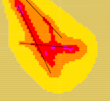

# AUSTAL Dispersion Analysis - Operating Guide

End-to-end walkthrough of the **Calculate Dispersion** dialog, from the QGIS toolbar to a vector layer plotted on the canvas. Covers each numbered section of the dialog in the order a user works through them. For initial AUSTAL installation and `austal.settings` setup, see `AUSTAL.md` in this folder; this guide assumes those are already done.

---

## Where to find the dialog

In QGIS, click the **Calculate Dispersion** button on the OpenALAQS toolbar:



The dialog opens with five collapsible sections, numbered roughly in execution order.


---

## 1. AUSTAL Executable

The first section, `executableGroupBox`. Tells the plugin which AUSTAL binary to invoke.

- **Field**: `a2k_executable_path`. Use the file picker to point at `austal.exe` (Windows) or `austal` (Linux). The filter only shows files matching that name.
- **Status**: a coloured label below the field reports `Executable Loaded` (green) or `No Executable Loaded` (yellow). Until the label is green, the rest of the dialog produces validation errors when you press Run.
- **Persistence**: the path is saved in `QgsSettings` under `open_alaqs/a2k_executable_path` and restored on next launch, so this step is one-time per machine.
- **AUSTAL Help button**: opens this section's setup documentation (`AUSTAL.md`).

---

## 2. Input File Strategy

The second section, `inputStrategyGroupBox`. Picks where AUSTAL's input files come from. Three radio buttons; pick exactly one.

| Radio | When to use |
|---|---|
| **Use Existing AUSTAL Input Files** | You have a folder with hand-prepared `austal.txt` / `series.dmna` / `zeitreihe.dmna` etc. The plugin will only run AUSTAL against that folder; it will not generate anything. |
| **Generate AUSTAL Input Files from OpenALAQS Emission Inventory File** | You have an OpenALAQS `*_out.alaqs` file from a prior emissions inventory run. The plugin generates the AUSTAL inputs from it (emissions + meteo + grid) and then runs AUSTAL. Receptor points are auto-loaded from the `shapes_receptor_points` table in the `.alaqs` file, or you can override with a receptor CSV. |
| **Generate AUSTAL Input Files from CSV** | You have an emissions CSV and a meteo CSV from outside OpenALAQS. The plugin assembles AUSTAL inputs from those two files. A receptor CSV picker is also exposed in this mode (no `.alaqs` file is involved, so receptors must come from the CSV if you want per-receptor results). |

Each radio reveals its own input fields below. The status label (`existingFilesStatusLabel`, `alaqsGenerationStatusLabel`, or `external_files_feedback`) reports what's still missing - work through the gaps until it goes green.

For the two "Generate" modes, the plugin writes the resulting AUSTAL input files into the **work directory** you specify, then proceeds to step 3 in the same folder.

### Datetime range

Both Generate modes show start/end datetime pickers. They default to a placeholder value but auto-populate to the inventory's actual time range as soon as you select the source file. Pick the slice of the inventory you want to disperse - this is a subset selection, not a recompute.

---

## Grid Configuration & Grid Management

Two grid sections appear inside step 2. They are **separate**:

### Calculation Configuration / Grid Management (`gridManagementGroupBox`)
Sets the receptor grid that AUSTAL will compute concentrations on. Either:
- pull it from an OpenALAQS `*_out.alaqs` file (the plugin reads `grid_3d_definition`), or
- type it manually in the **Grid Details** sub-section (x_cells, y_cells, x_resolution, y_resolution, ref lat/lon).

The grid you set here is the one written into AUSTAL's input file. Cell size is in **true ground metres**: the plugin builds the grid in local UTM, so a 100 m cell here is 100 m on the ground (modulo a ~2% mercator-projection effect when the grid is later reprojected for QGIS display).

The status panel below the inputs reports the active grid: number of cells, resolution, and reference lat/lon.

### Grid Management for visualisation (`alaqsGridGroupBox`, inside section 4)
A **second** grid pointer used **only for plotting**. When AUSTAL writes its result `.dmna` files, they reference cell indices, not lat/lon. To draw them on the map you also need a grid definition. This second selector lets you pick an `*_out.alaqs` or grid CSV that matches the run. In the common case where you generated inputs from an `*_out.alaqs`, point both sections at the same file.

There's also a **Save Grid as CSV** button (`saveGridCsvBtn`) that writes the current grid out to a CSV, and an **Update File** button (`updateFileBtn`) that re-reads the grid file if you've edited it externally.

---

## Receptor points, NOTALUFT, and PM10 split

Three controls inside step 2 affect what AUSTAL produces and which result modules are usable afterwards.

### Receptor points

AUSTAL writes per-receptor time series files (`<substance>-tmpa.dmna`) only when receptor points are passed to it via `xp` / `yp` lines in `austal.txt`. The plugin builds those lines from a `GeoDataFrame` of receptors. The data comes from:

- **ALAQS mode**: the **Receptors CSV** picker in the alaqs Generate sub-section first; if empty, the plugin auto-loads from the `shapes_receptor_points` table in the `.alaqs` file (filtered to `instudy != 'N'`); if that's also empty, AUSTAL runs without receptor lines.
- **CSV mode**: the **Receptors CSV** picker in the CSV input sub-section; nothing else is checked. If the picker is empty, AUSTAL runs without receptor lines.

Receptor CSV format (case-insensitive headers): `longitude`, `latitude`, optional `height` (defaults to 1.5 m), optional `EPSG` (defaults to 4326), optional `id` (label only). `lon` / `lat` are accepted as aliases.

Without receptors AUSTAL still runs to completion; it produces only the grid output (`<substance>-y00a.dmna`) and Plot Vector Layer continues to work, but Plot Time Series and Compliance Report stay disabled.

### NOTALUFT (per-hour series)

The **NOTALUFT** checkbox on the Output Mode row tells the dispersion module to write per-hour series, producing `<substance>-NNNa.dmna` files (one per simulation hour) and the receptor time-series `<substance>-tmpa.dmna` files. Without NOTALUFT, only the annual aggregate (`-y00a.dmna`) is written.

NOTALUFT is required for:
- Plot Time Series (reads `tmpa.dmna`)
- Compliance Report (reads `tmpa.dmna`)
- Plot Vector Layer with `hourly` or `8-hours mean` averaging (reads `NNNa.dmna`)

NOTALUFT is **not** required for Plot Vector Layer with `annual mean` averaging.

### PM10 fine fraction

The **PM10 fine fraction** spinbox (default 0.9) controls how PM10 emissions are split into AUSTAL's `pm-1` and `pm-2` substances when the writer expands a PM10 emission line. The default of 0.9 reflects an airport mix dominated by aircraft non-volatile PM and combustion exhaust (mostly fine particles); set lower (0.6–0.7) for studies dominated by re-suspended dust or brake wear.

If PM10 is not in the selected pollutant list, the spinbox is ignored.

---

## 3. Execution

The third section, `runGroupBox`. One button: **Run AUSTAL** (`RunA2K`).

When you click it, the plugin:
1. Validates that all upstream sections are green (executable, input strategy, grid). If anything is missing, a popup names the gap and the run is cancelled.
2. Updates `executionStatusLabel` to `Running AUSTAL...` and disables the button.
3. Spawns the AUSTAL executable as a subprocess in the work directory you configured. AUSTAL processes the inputs and writes its results (a `.dmna` file per pollutant per averaging period) into a sub-folder of the work directory.
4. On exit, parses the AUSTAL log; success makes the status label green, any non-zero exit code shows the AUSTAL error verbatim.

AUSTAL is single-threaded and CPU-bound; even modest grids take several minutes to a few hours. The QGIS UI stays responsive (the subprocess runs in the background) but you cannot start a second run from the same dialog until the first finishes.

---

## 4. Result Visualisation

The fourth section. Three buttons grouped under a **View Results** separator, all reading from the **Results Directory** field (`resultsWorkDirectoryPath`).

The Results Directory is auto-set to the work directory after a successful run. You can also point it at any other AUSTAL output folder via the **Load Existing Results** sub-section, which is how you visualise a run that finished outside this session.

| Button | What it does | Preconditions |
|---|---|---|
| **Plot Vector Layer** | Calls `ConcentrationsQGISVectorLayerOutputModule`. Builds a polygon vector layer (one feature per grid cell, attribute = concentration) and adds it to the QGIS canvas. The averaging combo selects which file is read: `annual mean` reads `<substance>-y00a.dmna`; `hourly` and `8-hours mean` aggregate `<substance>-NNNa.dmna` files (NOTALUFT required). `daily mean` is not currently implemented for the grid output. | Visualisation grid set; the `.dmna` file matching the chosen averaging period exists. |
| **Plot Time Series** | Calls `TimeSeriesDispersionOutputModule`. Reads `<substance>-tmpa.dmna` files directly and plots concentration vs time per receptor with a smoothing combo (raw / 1h / 8h / 24h / 7d), navigation toolbar, and CSV export. | At least one `*-tmpa.dmna` file in the work directory (i.e. AUSTAL run with receptors AND NOTALUFT). |
| **Compliance Report** | Calls `ComplianceReportOutputModule`. Per-receptor PASS/FAIL evaluation against EU Directive 2024/2881 limit values applicable from 1 January 2030. Reportable substances: PM10, PM2.5, NO2, NOx (ecosystem), SO2. CO/HC/CO2 are excluded (no formal EU ambient limits comparable to those modelled here). Each row reports value, threshold, allowed exceedances, and PASS/FAIL with colour coding. CSV export available. | Same as Plot Time Series: `*-tmpa.dmna` files present. |

The status label `receptorResultsStatusLabel` (under the buttons) lists which substances have receptor data available, or explains why the receptor-based buttons are disabled. Each button's tooltip gives a 3-step recipe for enabling it (add receptors, tick NOTALUFT, regenerate inputs, re-run AUSTAL).

### About the vector layer plot

The polygon layer is rendered in the project UTM zone so cells display as true `dd × dd` m squares. Each cell's geometry comes from the grid you selected in the visualisation grid section; each cell's attribute value comes from the corresponding `.dmna` file. Default styling is a graduated colour ramp on the concentration field, but the layer is a normal `QgsVectorLayer` - you can edit its symbology, classify by different fields if multiple pollutants are loaded, or export it to GeoPackage from the QGIS layers panel.

### About the compliance evaluation

Threshold values are hardcoded against the official directive ([EU 2024/2881 Annex I, Section 1](http://data.europa.eu/eli/dir/2024/2881/oj)) and cross-checked with the EEA Air Quality Status Report 2025 benchmark analysis. The report header line states which directive version is in use and how many receptors / substances were evaluated. The current limit set (binding from 1 January 2030):

| Substance | Annual mean (µg/m³) | Daily mean (µg/m³, max exceedances/year) | Hourly mean (µg/m³, max exceedances/year) |
|---|---|---|---|
| PM10 | 20 | 45 (≤18) | — |
| PM2.5 | 10 | 25 (≤18) | — |
| NO2 | 20 | — | 200 (≤3) |
| NOx (ecosystem) | 30 | — | — |
| SO2 | 20 | 50 (treated as absolute pending verification of exceedance count) | — |

---

## Typical end-to-end session

1. Open **Calculate Dispersion**.
2. **§1**: file-pick the AUSTAL executable (one-time per machine; it persists).
3. **§2**: pick a strategy. Most common: select **Generate from OpenALAQS Emission Inventory File**, browse to your `*_out.alaqs`, set the work directory and the time window.
4. **§2 / Grid Configuration**: confirm the grid was inherited from the inventory file. If not, fill in the details manually.
5. **§2 / Receptors + NOTALUFT** *(only if you want per-receptor results)*: provide a Receptors CSV (or rely on the auto-load from `shapes_receptor_points`) and tick **NOTALUFT**.
6. **§3**: click **Run AUSTAL**. Wait for green status.
7. **§4 / Grid Management**: point at the same `*_out.alaqs` so the plot has a grid.
8. **§4**: click **Plot Vector Layer** (annual mean concentration map), or, if you ran with NOTALUFT + receptors, **Plot Time Series** / **Compliance Report**.

---

## Common failure modes

- **`No Executable Loaded` even after picking the file** - the file picker doesn't accept anything not named `austal.exe` or `austal`. If you have `austal_3.3.exe`, rename it.
- **Run completes but the `.dmna` files are missing** - check that the AUSTAL installation has the `austal.settings` file from this OpenALAQS folder copied in. The default `austal.settings` shipped with AUSTAL writes to a different output schema and the plugin won't find the results.
- **`Plot Vector Layer` button stays disabled** - the visualisation grid (`alaqsGridGroupBox`) is unset. The execution grid and the visualisation grid are independent fields; both must be filled, even when they point at the same file.
- **`Plot Time Series` and `Compliance Report` stay disabled** - no `*-tmpa.dmna` files in the work directory. Both modules need receptors AND NOTALUFT set before the AUSTAL run; if either was missing, only the grid output (`-y00a.dmna`) was produced. The status label below the buttons names the missing piece. Re-run with both controls set.
- **Plot Vector Layer fails with "can't aggregate to '<period>'"** - you selected an averaging period (daily / hourly / 8-hours) that the file's time interval doesn't support. Switch the averaging combo to `annual mean` for grid plotting; for hourly/daily analysis use Plot Time Series or Compliance Report at receptor points.
- **Polygons appear in the wrong place on the map** - the visualisation grid does not match the run's grid. AUSTAL output cells are indexed; if you give the plotter a different reference lat/lon or cell size, it will draw cells at the wrong coordinates. Re-select the same `*_out.alaqs` for both grid sections.
- **Run takes hours and you're not sure it's progressing** - check the AUSTAL log file in the work directory. AUSTAL writes progress to `austal.log` (or similar) as it iterates over time steps; if the file is growing, the run is alive.

---

## Files written by a successful run

In the work directory after a green run:

```
work/
├── austal.txt                 # input file the plugin generated (or yours, if "use existing")
├── series.dmna                # time-resolved emission series
├── zeitreihe.dmna             # meteo time series (only if generated by plugin)
├── work/                      # AUSTAL's own output sub-folder
│   ├── austal.log             # run log
│   ├── <substance>-y00a.dmna  # annual-mean grid (always produced)
│   ├── <substance>-NNNa.dmna  # per-hour grid (NNN = hour index, NOTALUFT only)
│   ├── <substance>-tmpa.dmna  # per-receptor time series (receptors + NOTALUFT only)
│   └── ...
└── meta.txt                   # OpenALAQS-emitted run metadata
```

`<substance>` is the AUSTAL substance code (e.g. `co`, `nox`, `pm`, `pm25`, `so2`). The plugin writes `pm` for PM10 (split into `pm-1` + `pm-2` internally) and `pm25` for PM2.5; the readers map back automatically.

The visualisation buttons read from `work/` (the inner one). If you move the folder, point the Results Directory at the new location and the same buttons will still work.
