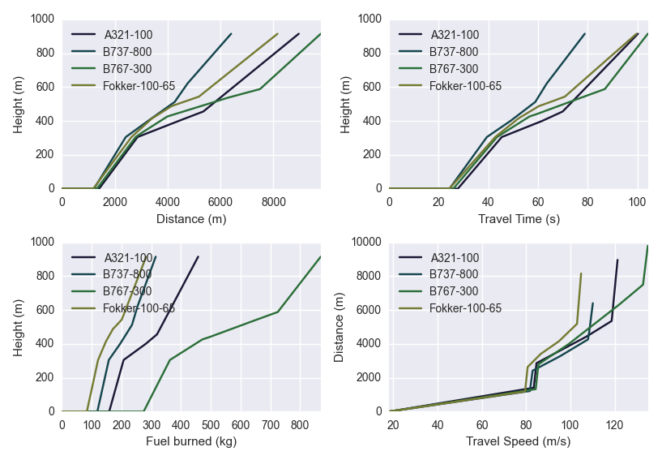
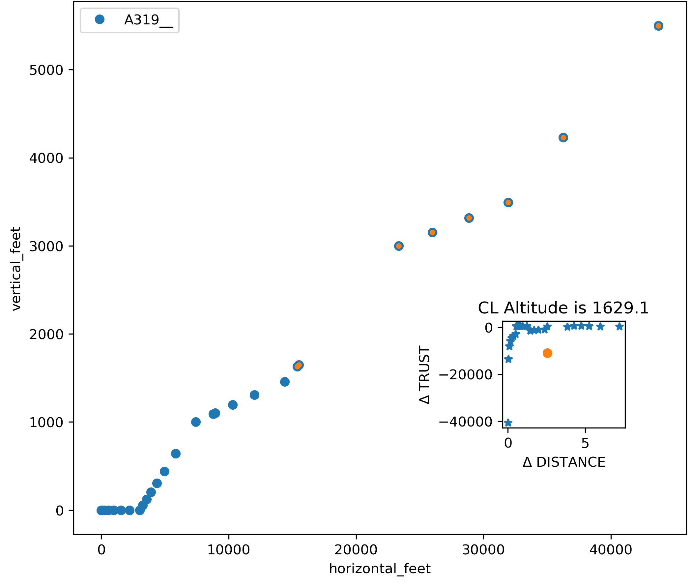
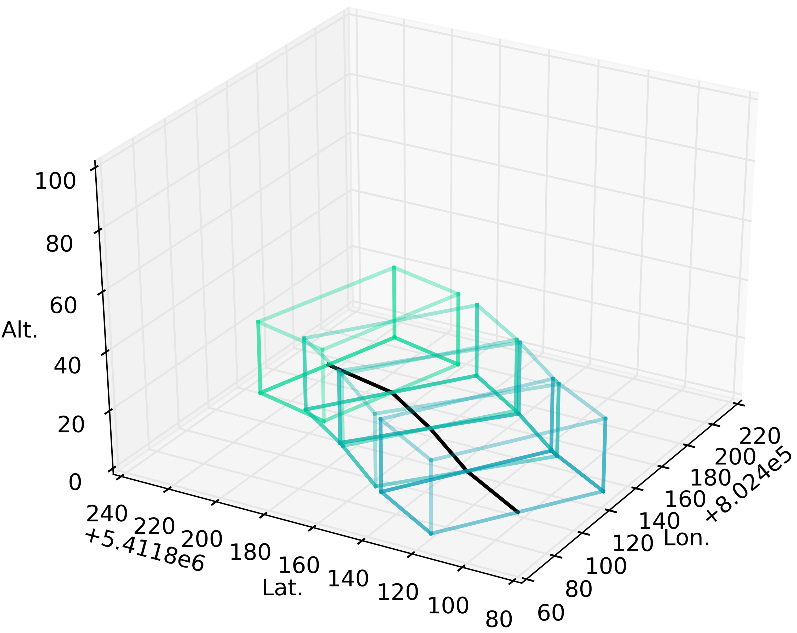

# Open-ALAQS User Guide - Auxiliary Material

## [Table of Contents](#table-of-contents)
- [Open-ALAQS Database](#open-alaqs-database)
  - [Aircraft and airport data](#aircraft-and-airport-data)
  - [Emissions factors](#emission-factors)
    - [Aircraft emissions](#aicraft-emissions)
    - [Non-aircraft emissions](#non-aircraft-emissions)
- [ANP](#anp)
  - [Aircraft trajectories](#aircraft-trajectories)
  - [Performance profiles](#performance-profiles)
- [AUSTAL](#austal)
- [COPERT](#copert)
- [Smooth and Shift](#smooth-and-shift)

## [Open-ALAQS Database](#open-alaqs-database)
[(Back to top)](#table-of-contents)

The internal [Open-ALAQS database](./../open_alaqs/database/data/) contains default emission factors for all airport sources. When the user creates a new study, these files are copied to the new **.alaqs** file. If the user has access to more up-to-date information, they can update the default data as described in the [README](./../README.md#updating-the-openalaqs-database-templates) file.

Alternatively, Open-ALAQS files can be easily viewed and edited with [DB Browser for SQLite](https://sqlitebrowser.org/) an open source tool designed for manipulating SQLite database files.

### [Aircraft and airport data](#aircraft-and-airport-data)

The internal database also contains an extenstive list of aircraft (see [default_aircraft](./../open_alaqs/database/data/default_aircraft.csv)) along with information on the most representative engine, APU, departure/arrival profiles and other characteristics.

A list of airports is also available (see [default_airports](./../open_alaqs/database/data/default_airports.csv)) with information on their location and elevation above ground.

### [Emissions factors](#emission-factors)

#### Aircraft emissions

Aircraft emissions are calculated based on the recommendations of [ICAO Doc. 9889](https://www.icao.int/publications/documents/9889_cons_en.pdf).

Information on exhaust emissions of aircraft engines is taken from the [ICAO Aircraft Engine Emissions Databank](https://www.easa.europa.eu/en/domains/environment/icao-aircraft-engine-emissions-databank) and the [FOCA Aircraft Piston Engine database](https://www.bazl.admin.ch/bazl/fr/home/themen/umwelt/schadstoffe/emissions-des-moteurs/rapport-recapitulatif--annexes--banque-et-feuilles-de-donnees.html). Default emission factors are also provided for some turboprop engine types, however the user can obtain additional information from the confidential [FOI Turboprop Emissions Database](http://www.foi.se/en/our-knowledge/aeronautics-and-air-combat-simulation/fois-confidential-database-for-turboprop-engine-emissions.html).

APU emissions are calculated separately as a function of the APU model (apu_id) indicated for each aircraft (if available) in the database (see [default_aircraft](./../open_alaqs/database/data/default_aircraft.csv)). The default APU emission factors and operating times are given in the database files: [default_aircraft_apu_ef](./../open_alaqs/database/data/default_aircraft_apu_ef.csv) and [default_apu_times](./../open_alaqs/database/data/default_apu_times.csv) respectively.

Default MES emission factors per aircraft group are given in the table [default_aircraft_start_ef](./../open_alaqs/database/data/default_aircraft_start_ef.csv).

#### Non-aircraft emissions

The corresponding GSE/GPU emission factors and activity time are included in the Open-ALAQS database (see [default_gate_profiles](./../open_alaqs/database/data/default_gate_profiles.csv)).

The internal Open-ALAQS database also contains default emission factors for stationary sources. These values can be modified if more up-to-date information is available to the user (see [default_stationary_ef](./../open_alaqs/database/data/default_stationary_ef.csv)).

## [ANP](#anp)
[(Back to top)](#table-of-contents)

The [Aircraft Noise and Performance](https://www.easa.europa.eu/en/domains/environment/policy-support-and-research/aircraft-noise-and-performance-anp-data) (ANP) database contains a standardized dataset with information related to aircraft flight performance under various conditions. This includes engine performance characteristics, such as the thrust or power settings (e.g., corrected net thrust) and how they vary with altitude and airspeed. The ANP database contains flight profiles for a wide variety of aircraft types, including standard departure and approach procedures. This data allows models to accurately simulate different segments of flight, like takeoff ground roll, climb, descent, and landing.

We note that in the context of EASA having a legal mandate to collect and verify the ANP data since Reg. (EU) 598/2014 has entered into force, the management and hosting of the ANP legacy data (version 2.3 and prior versions) have been transferred from EUROCONTROL to EASA in order to establish a single ANP data source.

### [Aircraft trajectories](#aircraft-trajectories)

In Open-ALAQS, the ANP fixed-point profiles (see [default_aircraft_profiles](open_alaqs/database/data/default_aircraft_profiles.csv)) are used to calculate aircraft emissions. The ANP fixed-point profiles contain information on the relative 2D trajectory of the aircraft (horizontal versus vertical distance) on the runway. These points are converted into an aircraft trajectory for a given runway based on its geographic coordinates. Currently, only straight-line trajectories are possible in Open-ALAQS.

### [Performance profiles](#performance-profiles)

The ratio of thrust to distance is used to define the cut-off between take-off and climb-out. During take-off, full thrust is required to accelerate the aircraft. As the aircraft reaches a certain distance and speed, thrust is reduced to a level appropriate for climb. This transition involves reducing thrust from maximum take-off to maximum climb thrust after a set distance, typically around 1000 feet of ground distance. This cut-off point is used in Open-ALAQS to separate the two modes.

The following figure illustrates this approach. For more information the user is referred to [ECAC.CEAC Doc 29, Volume 2, Appendix B](https://www.ecac-ceac.org/images/documents/ECAC-Doc_29_4th_edition_Dec_2016_Volume_2.pdf).

## [AUSTAL](#austal)
[(Back to top)](#table-of-contents)

The dispersion model [AUSTAL](https://www.umweltbundesamt.de/en/topics/air/air-quality-control-in-europe/overview) is the reference implementation to Annex 2 of the German Environment Agency’s Technical Instructions on Air Quality Control (TA Luft) and implements the specifications and requirements given therein.

The program is the successor of AUSTAL2000 (which was previously used with Open-ALAQS), the reference implementation to Annex 3 of the TA Luft 2002. AUSTAL and AUSTAL2000 were developed by Janicke Consulting on behalf of the German Environment Agency and are freely available and widely used internationally.

AUSTAL 3.3.0 (released on 22.03.2024) has been developed and tested under Windows and Linux. It is exclusively provided, free of charge under the GNU Public Licence, from the dedicated webpage
of the German Environment Agency.

No installation is needed for use with Open-ALAQS as the executables are already included in the Open-ALAQS package.

## [COPERT](#copert)
[(Back to top)](#table-of-contents)

The estimation of roadway traffic emissions (landside, airside and parking lots) in Open-ALAQS is based on COPERT Emission Factors (EF) (version 5.4.52), the EU standard vehicle emissions calculator, developed by [EMISIA](https://www.emisia.com/utilities/copert/) for the European Environment Agency (EEA) for calculating emissions associated with road transportation.

COPERT contains emission factors for more than 450 individual vehicle types (e.g. PC, LDV, HDV) considering various factors such as vehicle type, age, mileage, and driving conditions and operation modes to provide accurate emissions estimates for a specific country or region. Its methodology comprises the road transport chapters in the [EMEP/EEA Air Emissions Inventory Guidebook](https://www.eea.europa.eu/publications/emep-eea-guidebook-2023) and is consistent with the 2006 IPCC Guidelines for the calculation of greenhouse gas emissions.

The implementation (see [copert5.py](./../open_alaqs/core/tools/copert5.py)) of the COPERT methodology in Open-ALAQS preserves the core information from the original model, albeit with some simplification tailored to the scope of Open-ALAQS. It generates typical emission factors for roadway segments or parking areas based on parameters such as fleet year (as a proxy for Euro standard), country, fleet mix and total number of vehicles, temperature, average speed (all set via the study setup UI) and roadway segment length (taken from segment geometry).

The vehicle categories that are examined are Passenger Cars (PCs), Light Commercial Vehicles (LCVs), Heavy Duty Trucks (HDTs), buses and motorcycles which are commonly operating within and around the airports. Only petrol and diesel engines are included in the database. Emission factors are provided for 37 countries: EU27 Member States, EU27 aggregated, UK, Iceland, Norway, Switzerland, Liechtenstein, North Macedonia, Turkey, Albania, Serbia and Montenegro.

**Special remarks**:
- HDTs petrol: only “Conventional” Euro standard option is available
- Motorcycles: only “Petrol” fuel option is available
- Buses: only “Diesel” fuel option is available
- Evaporative emissions: only VOC pollutant is available
- Information on vehicle age is included in the Euro standard technology information
- The EF include information for idling, since they are developed based on both real-world driving and on lab tests, both of which include indling periods in the respective real-world driving and driving cycles

The EF values used in Open-ALAQS are available in [default_vehicle_ef_copert5](./../open_alaqs/database/data/default_vehicle_ef_copert5.csv).

## [Smooth and Shift](smooth-and-shift)
[(Back to top)](#table-of-contents)

Open-ALAQS calculates three-dimensional emission distributions for source groups associated with an airport. To apply this output to dispersion models, it is necessary to account for source dynamics such as turbulence, exhaust momentum from aircraft engines, and thermal plume rise. To simplify the application of emission outputs to a dispersion model—without the need to address each individual source's dynamics or specific model details—the effects of source dynamics can be included in an approximate manner within the spatial emission distribution. This is achieved through the "Smooth & Shift" approach, which involves smoothing and shifting the initial source extent.

This approach has been used to connect the emission grid provided by Open-ALAQS' precursor model, ALAQS-AV, to dispersion models. The details  are outlined in the report [EEC/SEE/2005/016](038_Derivation_of_Smooth_and_Shift_Parameters_for_ALAQS-AV.pdf) by EUROCONTROL. The "Smooth & Shift" parameters were originally derived from [LASPORT](https://www.janicke.de/en/lasport.html) (version 1.6), which handles source dynamics in a detailed and time-dependent manner.

Since 2005, the LASPORT parameter values used to describe the source dynamics of main engines have been updated. The following describes the new parameters based on LASPORT version 2.2. Finally, it is worth noting that the "Smooth & Shift" parameters are transparently derived and easy to modify. They have been implemented for all airport-related sources, including aircraft, GSE, and GPU. APU emissions are incorporated into aircraft movements.

The figure below illustrates the change in the geometry of taxiing emissions after applying the "Smooth & Shift" parametrization. Each linestring segment of the taxiway (black line) is expanded into a polygon to account for source dynamics.

The default values used in Open-ALAQS are available in [default_emission_dynamics](./../open_alaqs/database/data/default_emission_dynamics.csv).
