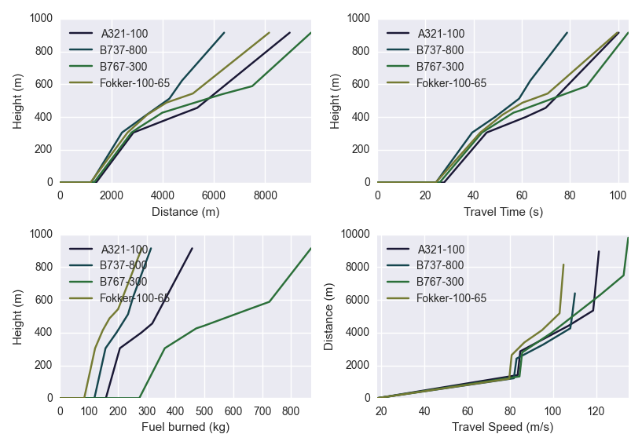
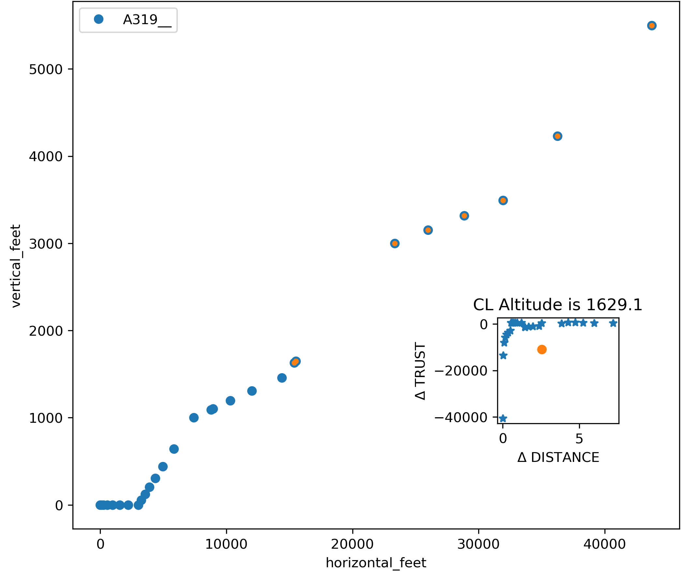
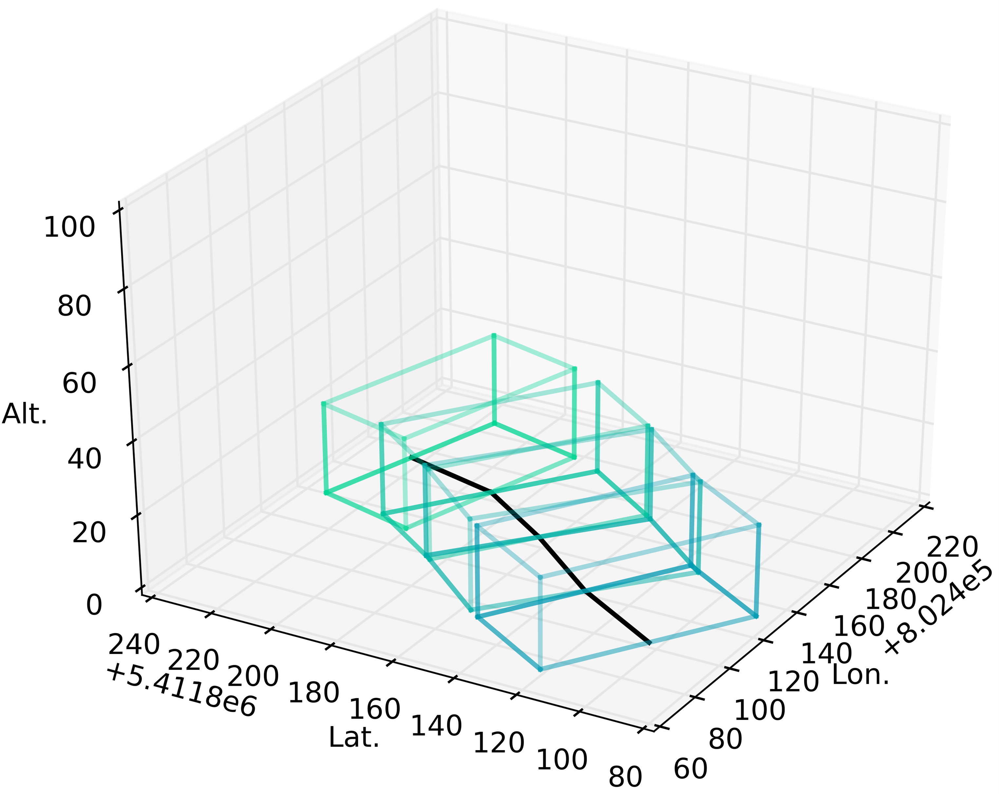
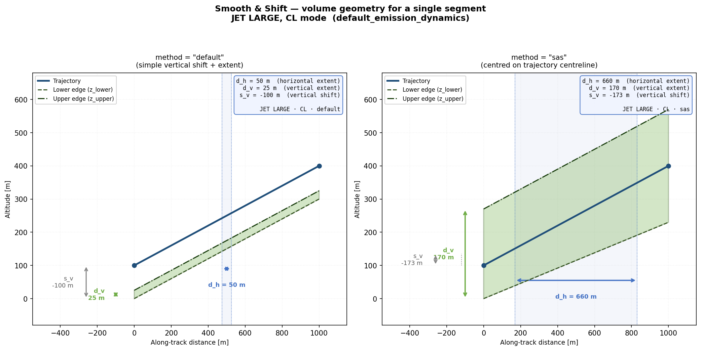
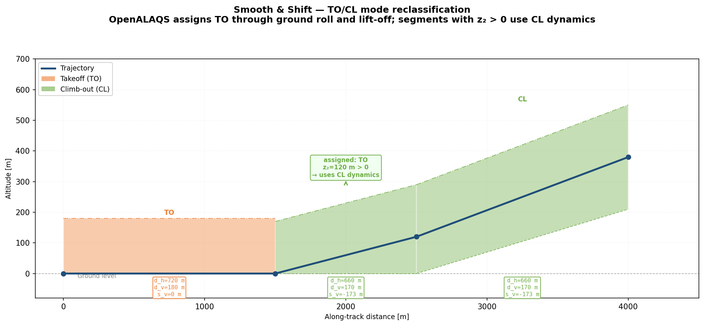
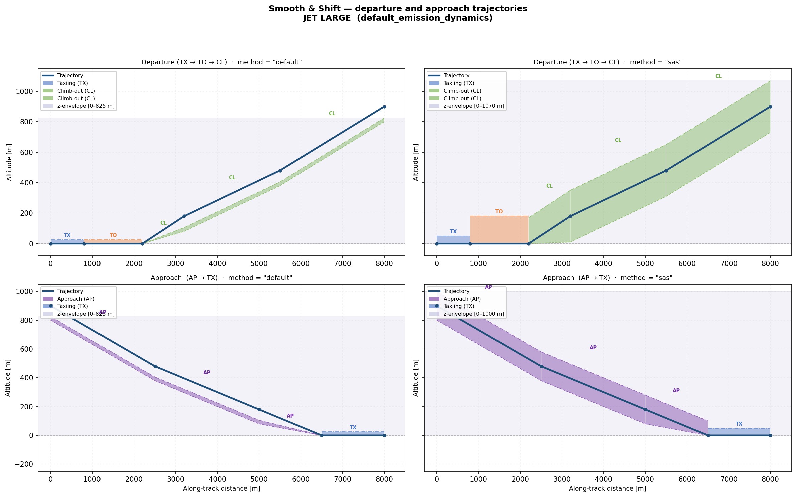
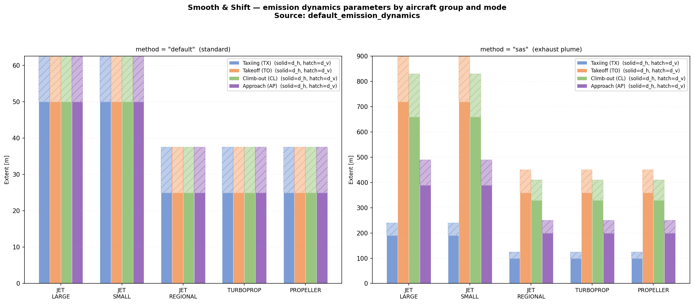

# OpenALAQS User Guide - Auxiliary Material

## [Table of Contents](#table-of-contents)
- [OpenALAQS Database](#OpenALAQS-database)
  - [Aircraft and airport data](#aircraft-and-airport-data)
  - [Emissions factors](#emission-factors)
    - [Aircraft emissions](#aircraft-emissions)
    - [Non-aircraft emissions](#non-aircraft-emissions)
- [ANP](#anp)
  - [Aircraft trajectories](#aircraft-trajectories)
  - [Performance profiles](#performance-profiles)
- [BFFM2](#bffm2)
- [AUSTAL](#austal)
- [COPERT](#copert)
- [Smooth and Shift](#smooth-and-shift)

## [OpenALAQS Database](#OpenALAQS-database)
[(Back to top)](#table-of-contents)

The internal [`OpenALAQS database`](./../open_alaqs/database/data/) contains default emission factors for all airport sources. When the user creates a new study, these files are copied to the new `.alaqs` file. If the user has access to more up-to-date information, they can update the default data as described in the [`README`](./../README.md#updating-the-openalaqs-database-templates) file.

Alternatively, OpenALAQS files can be easily viewed and edited with [`DB Browser for SQLite`](https://sqlitebrowser.org/) an open source tool designed for manipulating SQLite database files.

### [Aircraft and airport data](#aircraft-and-airport-data)

The internal database contains an extensive list of aircraft (see [`default_aircraft`](./../open_alaqs/database/data/default_aircraft.csv)) along with information on the most representative engine, APU, departure/arrival profiles and other characteristics.

A list of airports is also available (see [`default_airports`](./../open_alaqs/database/data/default_airports.csv)) with information on their location and elevation above ground.

### [Emissions factors](#emission-factors)

#### Aircraft emissions

Aircraft emissions are calculated based on the recommendations of [`ICAO Doc. 9889`](https://www.icao.int/publications/documents/9889_cons_en.pdf).

Information on exhaust emissions of aircraft engines is taken from the [`ICAO Aircraft Engine Emissions Databank`](https://www.easa.europa.eu/en/domains/environment/icao-aircraft-engine-emissions-databank) (EEDB) and the [`FOCA Aircraft Piston Engine database`](https://www.bazl.admin.ch/bazl/fr/home/themen/umwelt/schadstoffe/emissions-des-moteurs/rapport-recapitulatif--annexes--banque-et-feuilles-de-donnees.html). Default emission factors are also provided for some turboprop engine types; additional information can be obtained from the confidential [`FOI Turboprop Emissions Database`](http://www.foi.se/en/our-knowledge/aeronautics-and-air-combat-simulation/fois-confidential-database-for-turboprop-engine-emissions.html).

For the BFFM2 emission calculation method, see the [BFFM2 section](#bffm2) below.

##### Engine emission index table (`default_aircraft_engine_ei`)

The engine EI table contains one row per engine per LTO mode (TX, AP, CL, TO). The key columns are:

| Column | Description |
|---|---|
| `engine_name` | ICAO engine designator |
| `mode` | LTO mode: TX, AP, CL, TO |
| `fuel_kg_sec` | Reference fuel flow (kg/s per engine, SLS) |
| `nox_ei`, `co_ei`, `hc_ei` | EEDB gas-phase emission indices (g/kg) |
| `sox_ei` | SOx emission index (g/kg); default 1.0 for jet fuel |
| `pm10_ei` | Total combustion PM10 EI (g/kg) = `pm10_nonvol` + `pm10_sul` + `pm10_organic` |
| `pm10_nonvol` | Non-volatile PM (nvPM) mass EI (g/kg) from ICAO EEDB |
| `pm10_sul` | Sulphate vPM EI (g/kg); see PM10 breakdown below |
| `pm10_organic` | Organic vPM EI (g/kg); see PM10 breakdown below |
| `p1_ei`, `p2_ei` | PM1.0 and PM2.5 EI placeholders (g/kg); currently equal to `pm10_ei` |
| `nvpm_number_ei` | nvPM number EI (#/kg) from ICAO EEDB |
| `press_ratio` | Overall pressure ratio (OPR) for MEEM V1 correction |
| `meem_nvpm_m_i_f00_avg` | MEEM V1: average nvPM mass EI at F00 (mg/kg) |
| `nvpm_m_max_mgkg` | MEEM V1: maximum nvPM mass EI (mg/kg) |
| `meem_nvpm_n_i_f00_avg` | MEEM V1: average nvPM number EI at F00 (#/kg) |
| `nvpm_n_max_nkg` | MEEM V1: maximum nvPM number EI (#/kg) |

##### PM10 breakdown

Aircraft PM10 emissions are decomposed into three physical components, stored separately to allow independent reporting and future updating:

**Non-volatile PM (`pm10_nonvol`)** — carbonaceous (soot) particles measured at ICAO SLS conditions and stored in the EEDB. Subject to MEEM V1 ambient correction if 5-point data is available (see below).

**Sulphate PM (`pm10_sul`)** — volatile sulphate particles formed from sulphur in the fuel. Computed from the fuel sulphur content (FSC) and a conversion efficiency ε using ICAO Doc 9889 Appendix D:

```
pm10_sul (g/kg) = FSC (kg/kg) × ε × 3 062 500
```

The database uses **FSC = 500 ppm (0.0005 kg/kg)** and **ε = 0.024** (CAEP14 default), giving a constant value of **36.75 mg/kg** for all engines and all modes.

**Organic vPM (`pm10_organic`)** — volatile organic particles from unburned hydrocarbons, calculated by the parameterised vPM method from ICAO Doc 9889 Appendix D:

```
pm10_organic (g/kg) = δ_k × EI_HC (g/kg)
```

where δ_k is the mode-specific conversion factor:

| Mode | δ_k |
|---|---|
| TO | 115 |
| CL | 76 |
| AP | 56.25 |
| TX | 6.17 |

**Total combustion PM10** = `pm10_nonvol` + `pm10_sul` + `pm10_organic`, stored in `pm10_ei`.

**Brake wear (FOA3).** For arriving aircraft with MTOW > 18 632 kg, the first taxi segment receives an additional PM10 contribution from tyre and brake wear:

```
PM10_brake_wear (g) = MTOW (kg) × 0.000476 − 8.74
```

This is added to the PM10, P1, and P2 output columns, but does not appear in the combustion sub-component columns (`pm10_nonvol_kg`, `pm10_sul_kg`, `pm10_organic_kg`).

**P1 / P2.** These output columns are placeholders for PM1.0 and PM2.5 respectively. They are currently set equal to PM10 (including brake wear for arrivals) because dedicated sub-micron EEDB emission indices are not yet available. They will be updated as the data becomes available.

##### MEEM V1 — nvPM ambient correction

The ICAO EEDB nvPM emission indices are measured at SLS conditions (T = 288.15 K, P = 101 325 Pa, Mach = 0). The nvPM EI varies with combustor inlet pressure. The **MEEM V1** correction from CAEP14 / ICAO Doc 9889 Appendix C accounts for this.

When 5-point nvPM data is available for an engine (columns `meem_nvpm_m_i_f00_avg`, `nvpm_m_max_mgkg`, `meem_nvpm_n_i_f00_avg`, `nvpm_n_max_nkg`), OpenALAQS applies the following procedure at every profile segment:

1. Compute the ISA and ambient combustor inlet pressures P3_ISA and P3_amb from the OPR (`press_ratio`) and the ambient conditions in `tbl_InvMeteo`.
2. Convert the actual thrust setting to a ground-reference (ISA) equivalent: `F_GR = F_act × (P3_ISA / P3_amb)`.
3. Interpolate the corrected nvPM mass EI from the 5-point curve using log-log interpolation; the number EI uses linear interpolation.

The correction applies to both Bymode and BFFM2. Engines without 5-point MEEM data fall back to the stored EEDB nvPM EI without correction.

**APU emissions** are calculated separately as a function of the APU model (`apu_id`) indicated for each aircraft in [`default_aircraft`](./../open_alaqs/database/data/default_aircraft.csv). The default APU emission factors and operating times are given in [`default_aircraft_apu_ef`](./../open_alaqs/database/data/default_aircraft_apu_ef.csv) and [`default_apu_times`](./../open_alaqs/database/data/default_apu_times.csv) respectively. Whether APU emissions are included for a given movement is controlled by the `apu_code` field in the movements table:

| `apu_code` | Meaning |
|---|---|
| −1 or 0 | No APU emissions (default when field is empty) |
| 1 | APU running at gate/stand only |
| 2 | APU running during full taxi |

**MES (Main Engine Start) emissions** are given in [`default_aircraft_start_ef`](./../open_alaqs/database/data/default_aircraft_start_ef.csv) per aircraft group. The unit of the stored values is **grams per aircraft per start event** — that is, the value represents the total emission for all engines on the aircraft for one engine-start event. No per-engine multiplication is applied in the code. MES emissions are calculated for departure movements only. Whether MES emissions are included is controlled by the `gate_emissions_code` field in the movements table:

| `gate_emissions_code` | Meaning |
|---|---|
| 0 | Suppress all gate emissions (GSE, GPU, and MES) |
| 1 | Include all gate emissions (default) |

#### Non-aircraft emissions

The corresponding GSE/GPU emission factors and activity times are included in the OpenALAQS database (see [`default_gate_profiles`](./../open_alaqs/database/data/default_gate_profiles.csv)). Emission factors are expressed in grams of pollutant per hour and are assigned by gate type, aircraft category, and operation type.

The internal OpenALAQS database also contains default emission factors for stationary sources (see [`default_stationary_ef`](./../open_alaqs/database/data/default_stationary_ef.csv)). These values can be modified if more up-to-date information is available.

## [ANP](#anp)
[(Back to top)](#table-of-contents)

The [`Aircraft Noise and Performance`](https://www.easa.europa.eu/en/domains/environment/policy-support-and-research/aircraft-noise-and-performance-anp-data) (ANP) database contains a standardized dataset with information related to aircraft flight performance under various conditions. This includes engine performance characteristics and flight profiles for a wide variety of aircraft types, including standard departure and approach procedures.

We note that in the context of EASA having a legal mandate to collect and verify the ANP data since Reg. (EU) 598/2014 has entered into force, the management and hosting of the ANP legacy data (version 2.3 and prior versions) have been transferred from EUROCONTROL to EASA in order to establish a single ANP data source.

### [Aircraft trajectories](#aircraft-trajectories)

In OpenALAQS, the ANP fixed-point profiles (see [`default_aircraft_profiles`](./../open_alaqs/database/data/default_aircraft_profiles.csv)) are used to calculate aircraft emissions. Each profile contains a series of points describing the aircraft trajectory (horizontal and vertical distance, true airspeed, power setting, and LTO mode). These points are converted into an aircraft trajectory for a given runway based on its geographic coordinates. Currently, only straight-line trajectories are supported.

Two profile types are supported:

**Standard ANP profiles** (`course = ANP2.x` or similar): coordinates are along-runway distances. The `x_m` and `y_m` columns represent the horizontal distance from the runway threshold along the runway axis and lateral offset respectively.

**ADS-B / CUSTOM profiles** (`course = CUSTOM`): coordinates are geodesic East/North offsets (in metres) from the runway intersection. These are generated from ADS-B recordings and represent the actual flown trajectory. The `fuel_flow_kgm` column, if populated, contains the estimated total-aircraft ambient fuel flow in kg/s for use by the BFFM2 method. Before BFFM2 uses this value, it divides by the engine count to obtain a per-engine estimate. If the per-engine estimate exceeds the EEDB takeoff fuel flow (indicating an unreliable ADS-B estimate), the calculator automatically falls back to power-setting interpolation and logs a warning.

> **Note:** The standard EHRD test case files (`EHRD.alaqs`, `EHRD_out.alaqs`) use only standard ANP profiles. ADS-B / CUSTOM profile support is available but requires the user to populate `default_aircraft_profiles` with custom entries before use.



### [Performance profiles](#performance-profiles)

The ratio of thrust to distance is used to define the cut-off between take-off and climb-out. During take-off, full thrust is required to accelerate the aircraft. As the aircraft reaches a certain distance and speed, thrust is reduced to a level appropriate for climb. This transition typically occurs at around 1000 feet of ground distance. This cut-off point separates the TO and CL modes in OpenALAQS.

The following figure illustrates this approach. For more information the user is referred to [`ECAC.CEAC Doc 29, Volume 2, Appendix B`](https://www.ecac-ceac.org/images/documents/ECAC-Doc_29_4th_edition_Dec_2016_Volume_2.pdf).



## [BFFM2](#bffm2)
[(Back to top)](#table-of-contents)

The Boeing Fuel Flow Method 2 (BFFM2) is an advanced aircraft emission calculation method defined in SAE AIR-5715 and ICAO Doc. 9889. It is available as an alternative to the standard Bymode method in OpenALAQS.

For full technical details including the step-by-step procedure, ambient correction formulas, and validation results for the EHRD test case, see [`BFFM2.md`](documents/BFFM2_validation/BFFM2.md).

### Principle

Where Bymode assigns a fixed emission index per LTO mode (TX, AP, CL, TO) based on EEDB reference conditions, BFFM2 uses the actual power setting from each profile segment to derive a fuel-flow-dependent emission index. The method:

1. Converts the power setting to a reference fuel flow using twin-quadratic or piecewise-linear interpolation through the four EEDB breakpoints.
2. Applies ambient corrections (θ, δ, Mach number, humidity) to obtain the in-flight fuel flow.
3. Interpolates the emission index on a log-log curve through the four EEDB data points.
4. Computes the emission mass as `EI × FF × n_engines × time_in_segment / 1000`.

PM, SOx, and P1/P2 are not interpolated on the gas-phase curve. Instead, both Bymode and BFFM2 inject the mode-level EI values directly from the database (including MEEM V1 ambient correction for nvPM where 5-point data are available). BFFM2 therefore produces the same per-mode PM and SOx EI values as Bymode; differences in total PM between the two methods arise solely from differences in fuel burn driven by the different power-setting interpolation.

### Installation correction factors

Before log-log interpolation, the EEDB reference fuel flow values at each breakpoint are multiplied by installation correction factors (SAE AIR-5715):

| LTO mode | Correction factor |
|---|---|
| Takeoff (TO) | 1.010 |
| Climbout (CL) | 1.013 |
| Approach (AP) | 1.020 |
| Idle (TX) | 1.100 |

These corrections account for installation losses not captured in the engine-only EEDB certification data. They are applied automatically and are not user-configurable.

### Ambient corrections

+ **NOx**: `EI_corrected = EI_ref × exp(−19 × (ω − 0.00634)) × (δ^1.02 / θ^3.3)^0.5`
+ **CO and HC**: `EI_corrected = EI_ref × θ^3.3 / δ`

where θ = T / 288.15, δ = P / 101 325, and ω is the specific humidity (kg water / kg dry air). Ambient conditions are taken from `tbl_InvMeteo`.

### Important notes

+ **Do not enable Apply NOx Corrections together with BFFM2.** The BFFM2 formula already includes NOx ambient corrections internally. Enabling that option with BFFM2 active will double-correct the NOx emission index.
+ For the taxi phase, BFFM2 uses `engine_thrust_level_for_taxiing` (default 7%) for the moving segments. Queuing and stop-and-go idle phases always use true idle (7%) regardless of this setting.
+ For ADS-B / CUSTOM profiles, the `fuel_flow_kgm` column is used as the total-aircraft ambient fuel flow per segment. It is divided by the engine count before BFFM2 dispatch.

## [AUSTAL](#austal)
[(Back to top)](#table-of-contents)

The dispersion model [`AUSTAL`](https://www.umweltbundesamt.de/en/topics/air/air-quality-control-in-europe/overview) is the reference implementation to Annex 2 of the German Environment Agency's Technical Instructions on Air Quality Control (TA Luft) and implements the specifications and requirements given therein.

The program is the successor of AUSTAL2000 (which was previously used with OpenALAQS), the reference implementation to Annex 3 of the TA Luft 2002. AUSTAL and AUSTAL2000 were developed by Janicke Consulting on behalf of the German Environment Agency and are freely available and widely used internationally.

AUSTAL 3.3.0 (released on 22.03.2024) has been developed and tested under Windows and Linux. It is exclusively provided, free of charge under the GNU Public Licence, from the dedicated webpage of the German Environment Agency.

AUSTAL must be installed separately. For more information and links, see the [AUSTAL README](../documents/AUSTAL/AUSTAL.md).

## [COPERT](#copert)
[(Back to top)](#table-of-contents)

The estimation of roadway traffic emissions (landside, airside and parking lots) in OpenALAQS is based on COPERT Emission Factors (EF) (version 5.4.52), the EU standard vehicle emissions calculator, developed by [`EMISIA`](https://www.emisia.com/utilities/copert/) for the European Environment Agency (EEA).

COPERT contains emission factors for more than 450 individual vehicle types considering factors such as vehicle type, age, mileage, and driving conditions. Its methodology comprises the road transport chapters in the [`EMEP/EEA Air Emissions Inventory Guidebook`](https://www.eea.europa.eu/publications/emep-eea-guidebook-2023) and is consistent with the 2006 IPCC Guidelines.

The implementation (see [`copert5.py`](./../open_alaqs/core/tools/copert5.py)) of the COPERT methodology in OpenALAQS preserves the core information from the original model, albeit with some simplification tailored to the scope of OpenALAQS. It generates typical emission factors for roadway segments or parking areas based on fleet year (as a proxy for Euro standard), country, fleet mix, number of vehicles, temperature, average speed, and roadway segment length.

The vehicle categories examined are Passenger Cars (PCs), Light Commercial Vehicles (LCVs), Heavy Duty Trucks (HDTs), buses and motorcycles. Only petrol and diesel engines are included. Emission factors are provided for 37 countries: EU27 Member States, EU27 aggregated, UK, Iceland, Norway, Switzerland, Liechtenstein, North Macedonia, Turkey, Albania, Serbia and Montenegro.

**Special remarks**:
+ HDTs petrol: only "Conventional" Euro standard option is available
+ Motorcycles: only "Petrol" fuel option is available
+ Buses: only "Diesel" fuel option is available
+ Evaporative emissions: only VOC pollutant is available
+ The EF include information for idling periods

The EF values used in OpenALAQS are available in [`default_vehicle_ef_copert5`](./../open_alaqs/database/data/default_vehicle_ef_copert5.csv).

### Emission calculation procedure

The full calculation pipeline has two distinct stages: **EF computation at study setup time** and **emission mass calculation at run time**. Both are described below in the order the code executes them.

#### Stage 1 — Fleet-averaged EF computation (study setup)

When the user saves a roadway or parking feature in the study, OpenALAQS calls [`copert5.roadway_emission_factors()`](./../open_alaqs/core/tools/copert5.py) (COPERT 5 path, enabled by default) or [`lib_alaqs_method.roadway_emission_factors_alaqs_method()`](./../open_alaqs/core/tools/lib_alaqs_method.py) (legacy COPERT III path). The result — a fleet-mean EF in g/km per vehicle for each pollutant — is stored directly in the roadway's database row as `co_gm_km`, `nox_gm_km`, `pm10_gm_km`, `hc_gm_km`, `sox_gm_km`, `p1_gm_km`, and `p2_gm_km` in `shapes_roadways`.

**COPERT 5 path** (`copert5.py` + `copert5_utils.py`, Tier 3 method from EMEP/EEA Guidebook 2019):

1. **EF lookup** — `ef_query()` selects the EF row from `default_vehicle_ef_copert5` matching the roadway country and the closest tabulated speed (rounded to the nearest 10 km/h between 10 and 130 km/h). Separate rows exist for `Hot`, `Cold`, and `Evaporation` emission conditions.

2. **Hot emissions** — For each technology (vehicle category × fuel × Euro standard), the hot EF `e_hot [g/km]` is read directly from the table. Hot emission total:
   ```
   E_hot [g] = N_vehicles × M [km] × e_hot [g/km]
   ```
   where `M` is fixed at 1 000 km per vehicle (a per-segment normalisation; the actual distance is applied in Stage 2).

3. **Cold-start emissions** — `cold_mileage_fractions()` computes the cold mileage fraction β using EMEP/EEA Table 3-39:
   ```
   β = 0.6474 − 0.02545 × L − (0.00974 − 0.000385 × L) × T
   ```
   where L is the average trip length [km] (country-specific, from COPERT 1990 data) and T is the ambient temperature [°C] (from study setup). For diesel HDTs and buses a separate formula applies: `β = max(8.25 / L, 1)`. Motorcycles and petrol HDTs use β = 0 (hot emissions only).

   A pollutant-specific reduction factor `bc` (from EMEP/EEA Tables 3-41, 3-43, 3-46) modifies β for Euro 2 through Euro 6 petrol passenger cars and LCVs. Cold emission total:
   ```
   E_cold [g] = N_vehicles × M [km] × β × bc × e_cold [g/km]
   ```

4. **Total and fleet average** — `E_total [g] = E_hot [g] + E_cold [g]` summed across all technologies. The fleet-averaged EF is then:
   ```
   e_avg [g/km] = Σ E_total [g] / Σ (N_vehicles × M [km])
   ```
   This weighted average is the value stored in `co_gm_km`, `nox_gm_km`, etc.

5. **Evaporative VOC (parking only)** — `calculate_evaporation()` reads the `Evaporation` rows from `default_vehicle_ef_copert5`, sums diurnal and running-loss split components into `eVOC [g/day]` per vehicle, and scales by the parking idle time:
   ```
   VOC_evap [g/vehicle] = eVOC [g/day] × idle_time [min] / (24 × 60)
   ```
   For parking features, the stored `hc_gm_km` is:
   ```
   hc_gm_km = e_avg_VOC [g/km] × travel_distance [km] + VOC_evap [g/vehicle]
   ```

**Legacy ALAQS path** (`lib_alaqs_method.py`, modified COPERT III): follows the same fleet-averaging structure but uses speed-dependent polynomial EFs from the `default_vehicle_nox_ef`, `default_vehicle_co_ef`, and `default_vehicle_hc_ef` tables (eight-parameter formula: `EF = a + b×v + c×v² + d×v^e + f×ln(v) + g×exp(h×v)`). SOx, p1, and p2 are set to zero in this path.

#### Stage 2 — Emission mass calculation (run time)

During `RoadwaySourceModule.process()`, for each hour and each roadway source, OpenALAQS calls:

```python
emissions.addGeneric(
    source.getEmissionIndex(),          # EF dict: co_gm_km, nox_gm_km, ...
    source.getLength(unitInKM=True)     # roadway segment length [km]
    * activity_multiplier               # hourly fraction of annual traffic [-]
    * length_fraction                   # grid-clipping fraction [-]
    / 1000.0,                           # convert g → kg
    unit="gm_km",
    new_unit="kg",
)
```

`addGeneric` iterates the EF keys, replaces `gm_km` with `kg` in each key name, and accumulates:

```
emission [kg] = EF [g/km] × L [km] × activity_multiplier × length_fraction / 1000
```

where:
- `L [km]` is the geometric length of the roadway linestring (or the clipped length if grid bounds are active).
- `activity_multiplier` is derived from `getRelativeActivityPerHour()`, which combines the hour-of-day, day-of-week, and month-of-year profiles with `vehicles_per_year`, giving the fraction of total annual vehicle passages occurring in the current hour.
- `length_fraction` is 1.0 unless the roadway extends outside the calculation grid, in which case it is the ratio of the in-grid segment length to the total length.

The resulting `Emission` object (with `co_kg`, `nox_kg`, `pm10_kg`, etc.) is assigned the roadway geometry (clipped if applicable) and appended to the hourly output.

#### Pollutant mapping

| OpenALAQS output column | COPERT 5 source | Notes |
|---|---|---|
| `co_kg` | `eCO[g/km]` | Hot + cold |
| `hc_kg` | `eVOC[g/km]` + evaporation | VOC used as HC proxy; includes evaporative VOC for parking |
| `nox_kg` | `eNOx[g/km]` | Hot + cold |
| `sox_kg` | `eSO2[g/km]` | Hot only |
| `pm10_kg` | `ePM2.5[g/km]` | COPERT 5 reports PM2.5; used as PM10 proxy |
| `p1_kg` | `ePM0.1[g/km]` | PM0.1 from COPERT 5 |
| `p2_kg` | `ePM2.5[g/km]` | Same as pm10 |

> **Note on PM mapping:** COPERT 5 provides PM2.5 and PM0.1 emission factors. OpenALAQS maps PM2.5 to both `pm10_kg` and `p2_kg`, and PM0.1 to `p1_kg`. This is a simplification that overestimates PM10 relative to a dedicated coarse-fraction estimate. The legacy ALAQS path does not compute SOx, p1, or p2 (set to zero).

> **Note on CO2:** CO2 is not computed by the COPERT module. The `co2_kg` output column remains zero for roadway and parking sources.

## [Smooth and Shift](#smooth-and-shift)
[(Back to top)](#table-of-contents)

OpenALAQS calculates three-dimensional emission distributions for all airport source groups. To feed these distributions into downstream dispersion models, it is necessary to account for exhaust source dynamics: engine momentum, buoyant plume rise, and atmospheric diffusion in the near-field. The **Smooth & Shift** (SaS) approach approximates these effects by expanding each trajectory segment into a three-dimensional volume before it enters the emission grid.

This approach originates from the report [`EEC/SEE/2005/016`](038_Derivation_of_Smooth_and_Shift_Parameters_for_ALAQS-AV.pdf) (EUROCONTROL) and has been used to connect ALAQS-AV output to dispersion models. The SaS parameters in OpenALAQS were originally derived from [`LASPORT`](https://www.janicke.de/en/lasport.html) v1.6 and subsequently updated to reflect LASPORT v2.2. They are stored in `default_emission_dynamics` and can be modified per aircraft group and LTO mode.

The figure below shows a taxiway example: each linestring segment (black) is expanded into a lateral–vertical polygon volume.



### Volume geometry

For each emission segment between two consecutive trajectory points, SaS constructs a quadrilateral cross-section defined by three parameters per aircraft group and LTO mode:

| Parameter | Column (default method) | Column (sas method) | Description |
|---|---|---|---|
| `d_h` | `horizontal_extent_m` | `horizontal_extent_m_sas` | Full lateral width of the emission volume [m] |
| `d_v` | `vertical_extent_m` | `vertical_extent_m_sas` | Vertical extent of the emission volume [m] |
| `s_v` | `vertical_shift_m` | `vertical_shift_m_sas` | Vertical displacement of the volume centroid from the trajectory [m] |

Two methods are available, selected at run time:

**`default`** — the volume lower edge is displaced vertically by `s_v` from the trajectory point, and the volume extends upward by `d_v`:

```
z_lower = z_trajectory + s_v
z_upper = z_lower + d_v
```

**`sas`** — the volume is centred on the trajectory point (consistent with a Gaussian exhaust plume centred on the trajectory), with `d_v` controlling the full vertical spread:

```
z_lower = z_trajectory − d_v / 2
z_upper = z_trajectory + d_v / 2
```

> In both cases `z_lower` is clamped to zero (ground level cannot be negative).

The figure below illustrates these two formulations for a representative climb segment (JET LARGE, CL mode, EHRD_out.alaqs dynamics):



### LTO mode assignment and TO/CL reclassification

The LTO mode determines which row of `default_emission_dynamics` is used for each segment. OpenALAQS follows a different convention from LASPORT:

- **LASPORT** defines TO as the ground roll only; once the aircraft is airborne it enters CL.
- **OpenALAQS** assigns TO through the entire takeoff phase. A TO segment whose endpoint altitude `z₂ > 0` (i.e. the aircraft has left the ground) uses **CL dynamics** for the SaS volume. The LTO mode label on the emission record is not changed; only the dynamics lookup is reclassified.

This means the SaS volume widens and the vertical extent increases as soon as the aircraft leaves the ground, reflecting the transition from ground-roll to free-jet exhaust dynamics. The figure below shows this reclassification on a departure trajectory:



### Departure and approach trajectories

The figure below shows the full SaS volume geometry for a departure and an approach trajectory for a JET LARGE aircraft, using the dynamics values from `EHRD_out.alaqs`. Both methods are shown side by side. The coloured bands are the vertical extent of the emission volume at each segment; the navy shading indicates the overall z-envelope assigned to the emission record (`z_min` to `z_max`).



Key observations:
- Under the **default** method, approach (AP) segments have a downward-shifted volume (`s_v = −100 m` for JET LARGE), representing the exhaust plume below the glide slope centreline.
- Under the **sas** method, AP volumes are centred on the trajectory but vertically spread by `d_v = 100 m` and shifted by `s_v = −138 m`.
- The z-envelope of the full departure trajectory spans from ground level to well above 900 m under the sas method.

### Parameter values (EHRD_out.alaqs)

The figure below summarises `d_h` and `d_v` for the main aircraft groups and all four LTO modes under both methods. JET LARGE aircraft have the largest SaS volumes; helicopters and GSE have the smallest.



The complete table is available in [`default_emission_dynamics`](./../open_alaqs/database/data/default_emission_dynamics.csv). Key values for JET LARGE:

| Mode | `d_h` (default) | `d_v` (default) | `s_v` (default) | `d_h` (sas) | `d_v` (sas) | `s_v` (sas) |
|---|---|---|---|---|---|---|
| TX | 50 m | 25 m | 0 m | 190 m | 50 m | 0 m |
| TO | 50 m | 25 m | 0 m | 720 m | 180 m | 0 m |
| CL | 50 m | 25 m | −100 m | 660 m | 170 m | −173 m |
| AP | 50 m | 25 m | −100 m | 390 m | 100 m | −138 m |
