# OpenALAQS User Guide

## Table of Contents
- [OpenALAQS User Guide](#OpenALAQS-user-guide)
  - [Table of contents](#table-of-contents)
  - [Introduction](#introduction)
    - [General Information](#general-information)
    - [Installation](#installation)
  - [The OpenALAQS Toolbar](#the-OpenALAQS-toolbar)
  - [Starting a Study](#starting-a-study)
    - [Setup a new study](#setup-a-new-study)
    - [Open an existing study](#open-an-existing-study)
    - [Import OpenStreetMap data](#import-openstreetmap-data)
  - [Define emission sources](#define-emission-sources)
    - [Add Features](#add-features)
    - [Edit Features](#edit-features)
    - [Delete Features](#delete-features)
    - [Visualize and Edit Attribute Values](#visualize-and-edit-attribute-values)
    - [Aircraft related Sources](#aircraft-related-sources)
      - [Gates](#gates)
      - [Runways](#runways)
      - [Taxiways](#taxiways)
      - [Tracks](#tracks)
    - [Stationary Sources](#stationary-sources)
      - [Parking Lots](#parking-lots)
      - [Roadways](#roadways)
      - [Point sources](#point-sources)
      - [Area sources](#area-sources)
      - [Buildings](#buildings)
  - [Activity Profiles](#activity-profiles)
  - [Generate Emissions Inventory](#generate-emissions-inventory)
    - [Taxi routes](#taxi-routes)
    - [Create output file](#create-output-file)
    - [Movements table](#movements-table)
    - [Helicopters (FOCA 2015)](#helicopters-foca-2015)
    - [Meteorology](#meteorology)
  - [Calculate emissions and query results](#calculate-emissions-and-query-results)
  - [Dispersion modeling with AUSTAL](#dispersion-modeling-with-austal)
    - [Input data](#input-data)
    - [Running AUSTAL](#running-austal)
    - [Output data](#output-data)
    - [Visualize results](#visualize-results)
<!-- [FAQs](#faqs) -->
<!-- [Contact](#contact) -->

## [Introduction](#introduction)
[(Back to top)](#table-of-contents)

Welcome to the `OpenALAQS` user guide. This document will help you navigate the key features of the software, including setting up a study, emissions & dispersion calculations and exporting results in various formats.

### [General Information](#general-information)

OpenALAQS is a [`EUROCONTROL`](https://www.eurocontrol.int/) open-source tool designed to model and analyze emissions from aircraft operations and various airport sources. It can calculate emission inventories, visualize data, and perform dispersion modeling with the help of [`AUSTAL`](https://www.umweltbundesamt.de/en/topics/air/air-quality-control-in-europe/overview).

It is developed as a plugin for the open-source geographic information system [`QGIS`](https://qgis.org/), simplifying the definition of various airport elements (such as runways, taxiways, and buildings) and enabling the visualization of the spatial distribution of emissions and concentrations. It is fully based on an open architecture, making it easily adaptable to other GIS platforms and databases.

### [Installation](#installation)

For installation instructions, check the [`Installation Instructions`](../README.md#installation).

## [The OpenALAQS Toolbar](#the-OpenALAQS-toolbar)
[(Back to top)](#table-of-contents)


The toolbar consists of the following functions:

+ **About**: General information about the current OpenALAQS version.
+ **Create Study**: Create a new OpenALAQS project.
+ **Open Study**: Open an existing OpenALAQS project.
+ **Close Study**: Close the current project.
+ **Study Setup**: Contains general information about the study.
+ **Import OSM Data**: Download and import data from OpenStreetMap (OSM).
+ **Profile Editor**: Create activity profiles (hourly, daily, monthly).
+ **Routes Editor**: Create taxi routes based on user-defined airport elements (gates, runways, taxiways).
+ **Generate Emission Inventory**: Prepares the OpenALAQS output file containing all study data.
+ **Visualize Emissions Calculation**: Manages the emissions calculation, visualization, and export modules.
+ **Calculate Dispersion**: Handles the dispersion calculation module.
+ **Review Logs**: Opens the log file containing useful information about code execution. When running BFFM2, the log records a confirmation line per movement (`BFFM2 dispatch confirmed`) and per-segment diagnostics at DEBUG level. Warnings appear when ADS-B fuel flow estimates exceed the EEDB takeoff ceiling and the calculator falls back to power-setting interpolation.

The order of the toolbar buttons generally follows the sequence of steps needed to conduct a study using OpenALAQS.

## [Starting a Study](#starting-a-study)
[(Back to top)](#table-of-contents)

This section describes the initial steps required to create an OpenALAQS study.

### [Setup a new study](#setup-a-new-study)
To create a new project, click on the `CREATE` button in the OpenALAQS toolbar. This action opens a pop-up window named `Create an Open ALAQS project file`, where the user is required to select a `File name` for saving the new study (`.alaqs`).

After creating a project, the `ALAQS Project Properties` window opens automatically. In this window (tab `Airport`), the user must provide a project name and at least the ICAO code of the airport. The remaining fields (airport name, country, latitude, longitude, etc.) will be automatically filled based on the information in the internal database (see `default_airports.csv`). However, the user can manually edit this default information if needed.

<p align="center">
  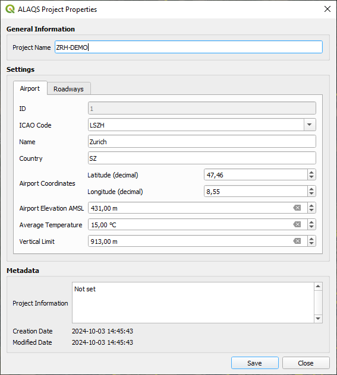
  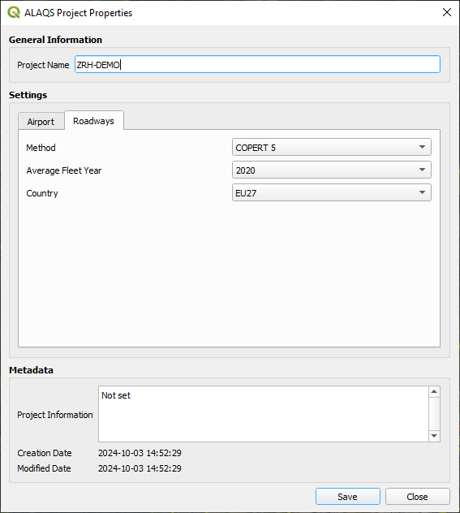
</p>

The second tab (`Roadways`) contains the settings for calculating road traffic emissions with [`COPERT`](https://copert.emisia.com/). Users are required to specify the average fleet year (values range from 1990 to 2030 in steps of 5) and select a country for country-specific emissions factors (or alternatively EU27). It should be noted that the average fleet year should be viewed as a proxy between the average fleet age and the Euro 1, Euro 2, Euro 3, Euro 4, Euro 5, and Euro 6 vehicle emission standards.

The `ALAQS Project Properties` window can also be accessed by clicking on the `Setup` button in the OpenALAQS toolbar.

### [Open an existing study](#open-an-existing-study)
To open a previously created project, click on the `OPEN` button in the OpenALAQS toolbar. This action opens a pop-up window (`Open an ALAQS database file`), allowing you to select an existing OpenALAQS database (`.alaqs`) file.

### [Import OpenStreetMap data](#import-openstreetmap-data)
An additional functionality is added to OpenALAQS to facilitate the creation of emission sources based on the geographic data (roads, buildings, points of interest, and more) provided by OpenStreetMap.

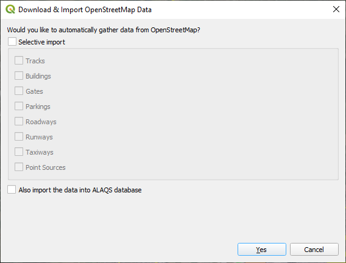

Using Nominatim, a search engine that uses the data from OpenStreetMap to provide geocoding (address to coordinates), directly from the OpenALAQS toolbar the user can select and import airport related geographical data to the study. The image below illustrates the information that can be collected from OpenStreetMap.

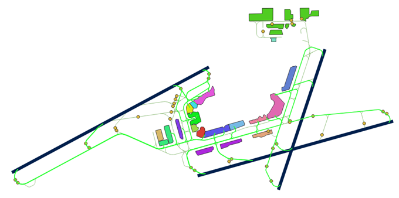

## [Define emission sources](#define-emission-sources)
[(Back to top)](#table-of-contents)

### [Add Features](#add-features)
New objects can be added using the `Digitizing` toolbar.


More information on how to use this toolbar is provided in the [`QGIS User Manual`](https://docs.qgis.org/3.34/en/docs/user_manual/working_with_vector/editing_geometry_attributes.html#digitizing-an-existing-layer).

To create a new emission source, select the desired layer (e.g., taxiway or runway) to activate it and click `Toggle Editing` in the `Digitizing` toolbar. Then click `Add Feature` to start designing the new feature. Once finished, right click and fill the attribute fields in the pop-up window.

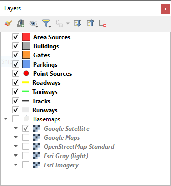

### [Edit Features](#edit-features)
Using the `Digitizing` toolbar in editing mode (`Toggle Editing`), it is possible to employ the `Vertex Tool` to edit objects.

### [Delete Features](#delete-features)
To delete one or more features, first select the geometry using the `Selection` toolbar (_Select Features by area or single click_) and use the `Delete Selected` tool to delete the feature(s). Multiple selected features can be deleted at once. Selection can also be done from the Attributes table.

### [Visualize and Edit Attribute Values](#visualize-and-edit-attribute-values)
Attribute values can also be modified after an object's creation via the `Attributes` toolbar.


The `Open Attribute Table` functionality can be accessed through the `Attributes` toolbar or via the `Layers` panel (by right-clicking on the appropriate layer).

### [Aircraft related Sources](#aircraft-related-sources)
Calculating aircraft emissions requires the definition of three distinct layers: runways, taxiways, gates. For each of these features, the user must provide the required attributes. Defining Tracks (i.e., aircraft trajectories) is also possible; however, this functionality is `not yet fully implemented`.

#### [Gates](#gates)
An airport gate refers to a designated location at an airport where aircraft park for boarding and disembarking passengers, loading/unloading cargo, and receiving services like refuelling, catering, and maintenance.

In OpenALAQS, gates are represented as polygons. Each gate can encompass several aircraft stands. The more stands grouped together within a single gate area, the less data preparation is needed (e.g., fewer taxi routes to define). However, if the gate area is too large, it might no longer accurately represent the location of the emissions.

Calculating gate emissions requires establishing the sum of four emission sources: GSE (Ground Support Equipment), GPU (Ground Power Unit), APU (Auxiliary Power Unit) and MES (Main Engine Start).

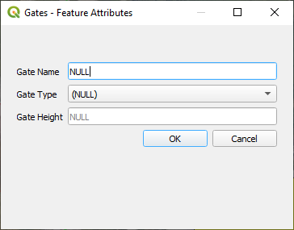

When adding a gate, the following information is required:
+ Gate type (PIER, REMOTE or CARGO)
+ Gate height `not yet fully implemented`

In OpenALAQS, GSE and GPU emission factors, expressed in terms of grams of pollutant per hour, are assigned to each gate as a function of:
+ The gate type (PIER, REMOTE or CARGO)
+ The aircraft category (JET BUSINESS/REGIONAL/SMALL/MEDIUM/LARGE, TURBOPROPS, PISTON)
+ The operation type (Arrival or Departure)

More information on the corresponding GSE/GPU, APU and MES emission factors and activity time is available in [`OpenALAQS database`](AUXILIARY_MATERIAL.md#OpenALAQS-database).

#### [Runways](#runways)

Runways are linear features that define the vertical plane where approach, landing, take-off, and climb-out operations occur. Each end of the runway is designated as a specific runway, depending on the direction of movement.

When adding a runway, the following information is required:
+ Capacity (departures/hour) `not yet fully implemented`
+ Touchdown offset (meters) `not yet fully implemented`
+ Maximum queue speed (km/h) `not yet fully implemented`
+ Peak queue time (minutes) `not yet fully implemented`

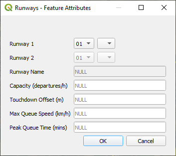

Airport runways are named based on their compass heading, rounded to the nearest 10 degrees. Since runways can be used in both directions, each end has a different number, differing by 18 (180 degrees). Parallel runways may be further differentiated by letters L (Left), C (Center), or R (Right).

The runway emissions are calculated based on the aircraft trajectories (profiles) provided in the [`Aircraft Noise and Performance`](https://www.easa.europa.eu/en/domains/environment/policy-support-and-research/aircraft-noise-and-performance-anp-data) (ANP) database. For more information, see the [`ANP`](AUXILIARY_MATERIAL.md#anp) section.

#### [Taxiways](#taxiways)

An airport taxiway is a designated path that connects runways with terminals, gates, or other parts of the airport. When adding a taxiway in an OpenALAQS study, the following information is mandatory:
+ Name
+ Speed (km/h)

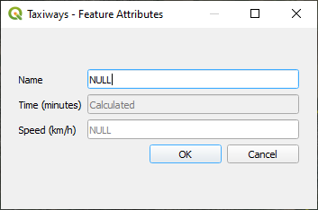

The length of each taxiway is calculated automatically from its geometry and the time spent on it is calculated from the indicated speed and length. Recommended taxiing speeds vary in relation to ambient conditions, traffic, and aircraft position on the taxi route. Typical taxiing speeds lie between 10 and 40 km/h (~5 and ~25 kts).

It is important to distinguish between taxiways and taxi-routes. Taxi-routes describe the operational path that will be followed by an aircraft for a runway / stand / movement type (arrival or departure) combination. Taxi-routes are defined as a series of taxiway segments in OpenALAQS. The process of defining taxi routes is detailed in the [`Test Case Study`](TEST_CASE_STUDY.md#taxi-routes).

#### [Tracks](#tracks)

Aircraft tracks define custom aircraft trajectories. When adding aircraft tracks, the following information is mandatory:
+ Track Name
+ Runway (from the list of previously defined runways)
+ Operation Type (Arrival or Departure)

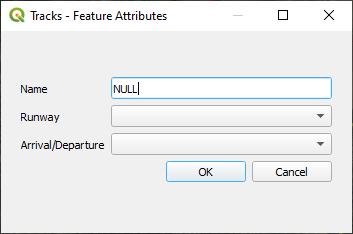

Standard departure and approach trajectories are taken from ANP fixed-point profiles (see `profile_id` in the Movements table). Alternatively, ADS-B-derived profiles can be used by setting `profile_id` to a profile with `course = CUSTOM` in `default_aircraft_profiles`. In CUSTOM profiles, the `x_m` and `y_m` coordinates are East/North geodesic offsets from the runway intersection rather than along-runway distances, and the optional `fuel_flow_kgm` column carries the estimated total-aircraft ambient fuel flow (kg/s) used by BFFM2. See the [`Auxiliary Material`](AUXILIARY_MATERIAL.md#aircraft-trajectories) for details.

### [Stationary Sources](#stationary-sources)
[(Back to top)](#table-of-contents)

For non-aircraft emissions four additional emission sources can be considered: point sources, roadways and parking lots, area sources, buildings. For each feature, the user must input the required attributes.

#### [Parking Lots](#parking-lots)

Emissions from parking areas for vehicles are estimated based on the [`COPERT`](AUXILIARY_MATERIAL.md#copert) methodology.

When adding an airport parking lot, the following information is required:
+ **Parameters**
  + **Number per year**: Total number of vehicles per year
  + **Height**: Height at which emissions are released (in meters) `not yet fully implemented`
  + **Speed**: Average travel speed in parking (in km/h)
  + **Travel distance**: Average travel distance in parking (in meters)
  + **Idle time**: Vehicle average idling time between entry and exit (in minutes)
  + **Average parking time**: Average time a vehicle remains on parking (in minutes)
+ **Profiles**
  + Hourly, Daily or Monthly activity profiles
+ **Fleet mix**
  + **PC (Petrol) [in %]**: Passenger Cars (Petrol)
  + **PC (Diesel) [in %]**: Passenger Cars (Diesel)
  + **LDV (Petrol) [in %]**: Light Duty Vehicles (Petrol)
  + **LDV (Diesel) [in %]**: Light Duty Vehicles (Diesel)
  + **HDV (Petrol) [in %]**: Heavy Duty Vehicles (Petrol)
  + **HDV (Diesel) [in %]**: Heavy Duty Vehicles (Diesel)
  + **Motorcycles [in %]**
  + **Buses [in %]**

<p align="center">
  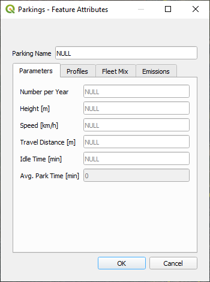
  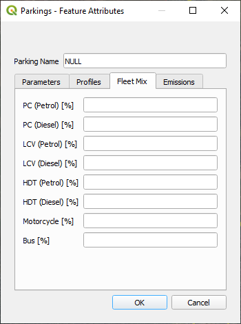
  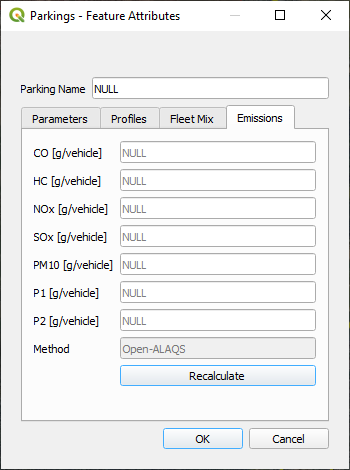
</p>

The user should ensure that the fleet mix totals 100% (see the `Fleet Mix` tab). Custom emission factors are calculated (using the `Recalculate` button in the `Emissions` tab) for each parking area using [`COPERT`](AUXILIARY_MATERIAL.md#copert) version 5.4.52, based on the parameters indicated above, as well as the average fleet year and country specified at the beginning of the study setup.

Custom activity profiles can also be defined for each parking area (see [`Activity Profiles`](#activity-profiles)).

#### [Roadways](#roadways)

Airside or landside emissions are calculated using the same methodology as described above.

When adding a roadway, the following information is required:
+ **Parameters**
  + **Movements per year**: Number of annual movements
  + **Height**: Height at which emissions are released (in meters) `not yet fully implemented`
  + **Speed**: Vehicle speed on roadway (in km/h)
+ **Profiles**:
  + Hourly, Daily or Monthly activity profiles
+ **Fleet mix**
  + **PC (Petrol) [in %]**: Passenger Cars (Petrol)
  + **PC (Diesel) [in %]**: Passenger Cars (Diesel)
  + **LDV (Petrol) [in %]**: Light Duty Vehicles (Petrol)
  + **LDV (Diesel) [in %]**: Light Duty Vehicles (Diesel)
  + **HDV (Petrol) [in %]**: Heavy Duty Vehicles (Petrol)
  + **HDV (Diesel) [in %]**: Heavy Duty Vehicles (Diesel)
  + **Motorcycles [in %]**
  + **Buses [in %]**

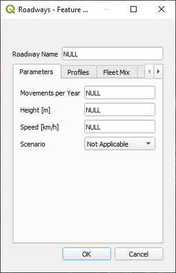

#### [Point sources](#point-sources)

Stationary or infrastructure-related emissions from airport facilities, such as power and heating plants, incinerators, training fires, fuel storage tanks, and stationary internal-combustion engines, are represented as point sources in OpenALAQS.

When adding a point source, the following information is required:
+ **Parameters**
  + **Category**: Source category. Seven categories ship by default: *Other* (0), *Incinerator* (1), *Power/Heat Plant* (2), *Fuel Tank* (3), *Solvent Degreaser* (4), *Surface Coating* (5), *Stationary IC Engine* (6).
  + **Type**: Category-specific type. The full set is in [`default_stationary_ef`](./../open_alaqs/database/data/default_stationary_ef.csv); examples include natural gas, light/heavy fuel oil, JP-4, JP-5, JET A, automobile gasoline, aviation gasoline.
  + **Height**: Height at which emissions are released (in metres). `Not yet fully implemented`.
  + **Activity per year**: How much the source operates in one inventory year. The numeric value of throughput, fuel consumed, or hours run.
  + **Activity unit** (read-only): Unit paired with *Activity per year*. Inherited from the selected emission factor row (`default_stationary_ef.activity_unit`). Examples: `1000_m3` (natural gas throughput), `1000_L` (liquid-fuel throughput), `hr` (engine operating hours), `1000_kg` (solid waste / coating).
+ **Profiles**: Each point source carries one *hour*, one *day*, and one *month* profile. The profiles split the *Activity per year* total into a per-hour timeline across the inventory year. Three named profiles ship with the templates: `heating_season` (winter-weighted month profile), `cooling_season` (summer-weighted month profile), and `business_hours` (8 AM to 6 PM weekday hour profile). Pick the named profile that matches the source, or define a custom profile via the OpenALAQS Toolbar → *Activity Profiles* panel.

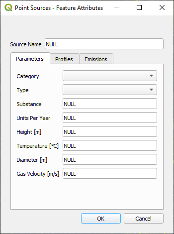

The internal OpenALAQS database contains default emission factors for each category and type (see [`default_stationary_ef`](./../open_alaqs/database/data/default_stationary_ef.csv)). Each emission factor (CO, HC, NOx, SOx, PM10, P1, P2) is in kilograms per *Activity unit*. The per-hour emission is:

```
emission_kg_per_hour
    = EF_kg_per_activity_unit
    × annual_activity
    × hour_profile_factor
    × day_profile_factor
    × month_profile_factor
    / 8760
```

where the three profile factors are dimensionless and average to 1.0 across the year. For a source with all three profiles set to *constant* (1.0 everywhere), the hourly emission is simply `EF × annual_activity / 8760`, equivalent to a uniform spread across the inventory year.

**Worked examples**:

+ *Heating plant on natural gas* (Category 2): 850 000 m³ consumed per year → enter `Activity per year = 850`. The selected type's row has `activity_unit = 1000_m3` (read-only). With `nox_kg_k = 1.9`, annual NOx = 850 × 1.9 = 1 615 kg.
+ *Diesel backup generator* (Category 6, Stationary IC Engine): 400 operating hours per year → enter `Activity per year = 400`, `activity_unit = hr`. With `nox_kg_k = 0.012`, annual NOx = 400 × 0.012 = 4.8 kg.
+ *Incinerator* (Category 1): 3 200 tonnes of waste per year → enter `Activity per year = 3200`, `activity_unit = 1000_kg`. The EF applies to the 3 200 figure directly.
+ *Fuel storage tank* (Category 3): 1 800 000 L throughput per year → enter `Activity per year = 1800`, `activity_unit = 1000_L`. The EF here represents evaporative VOC losses per thousand litres throughput.

**Schema migration note**: studies produced by older plugin versions used a single `units_per_year` field (hours per year only) without an explicit activity unit. The `scripts/migrate_alaqs.py` tool upgrades legacy `.alaqs` files in place, renames `units_per_year` to `annual_activity`, adds the `activity_unit` column to `shapes_point_sources`, and reports any source pinned to an emission-factor row that has since been deprecated. See `documents/AUXILIARY_MATERIAL.md` for the v2 schema reference.

**Stationary IC Engine sources** are a v2 addition (category 6) and use `hr` as the activity unit (engine operating hours per year). Available types include diesel and natural-gas reciprocating engines at three power tiers (<50 kW, 50 to 500 kW, >500 kW); pick the type that matches the rated power of the engine on site.

#### [Area sources](#area-sources)

This layer allows users to include emissions from custom, user-defined sources not covered by the standard OpenALAQS sources, as long as they have the relevant emission factor information.

When adding an area source, the following information is required:
+ Parameters:
  + Units per year: Number of operating hours per year
  + Height: Height at which emissions are released (in meters) `not yet fully implemented`
  + Heat Flux: Heat flux (in Megawatts) `not yet fully implemented`
+ Emissions: Emission factors for CO, HC, NOX, SOX, PM10 (in kg/unit)
+ Profiles: Hourly, Daily or Monthly activity profiles (default or custom)

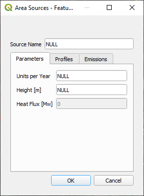

The emission calculation is: `emission (kg) = EF (kg/unit) × units_per_year × (interval_hours / 8760)`.

Beyond the standard pollutants, two additional pollutants **P1** and **P2** can be defined by the user. For aircraft movements, P1 and P2 are placeholders for PM1.0 and PM2.5 respectively, currently set equal to PM10 until dedicated emission indices become available in the EEDB (see [`PM10 output columns`](#pm10-output-columns)).

#### [Buildings](#buildings)

Buildings are not currently considered emission sources. However, they can significantly impact dispersion modelling by affecting wind patterns and turbulence. While this functionality is `not yet fully implemented`, it is included in the layers list for future use.

When adding a building, the following detail is required:
+ Building height (Height of building above ground, in meters) `not yet fully implemented`

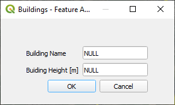

## [Activity Profiles](#activity-profiles)
[(Back to top)](#table-of-contents)

Activity Profiles are used to describe the relative hourly/daily/monthly operational mode for each airport emission source. The `Activity Profiles Editor` in the OpenALAQS toolbar can be used to review, edit, and create custom profiles.

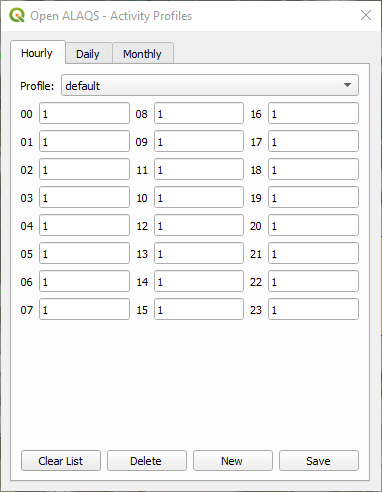

Profiles are **separable shape factors**, not absolute activity ratios. For each hour of the simulation, OpenALAQS multiplies the source's annual emission by

```
operating_factor * hour_factor * weekday_factor * month_factor / profile_mean
```

where `operating_factor = annual_total_operating_hours / hours_in_year`, the three factors are looked up from the assigned profiles, and `profile_mean` is the calendar-weighted mean of `hour_factor × weekday_factor × month_factor` over the simulated year. The internal normalisation by `profile_mean` guarantees that the source's total annual emission equals `EF × annual_total_operating_hours` regardless of the profile shape.

Each factor is a non-negative decimal number. Values are not capped at 1.0; what matters is the ratio between values within a profile. The default profile values are all 1, which produces a uniform distribution: each hour/weekday/month receives its naive share of the annual emission.

> **Note:** Because of the `profile_mean` normalisation, setting a factor to 0 for a specific period (e.g. night-time curfew) zeroes the emission in that period but **redistributes the mass to the remaining non-zero periods** — the total annual emission is preserved. To actually reduce a source's annual emission, lower its `unit_year` (or `ops_year`) field rather than zeroing profile entries.

> **Note:** Profiles whose calendar-weighted mean is exactly 0 (every entry zero) are handled specially: the multiplier evaluates to 0 for every hour, so emissions remain 0 throughout the simulation. There is no normalisation in this case.

## [Generate Emissions Inventory](#generate-emissions-inventory)
[(Back to top)](#table-of-contents)

This section covers all the necessary steps for preparing an emission inventory using OpenALAQS.

### [Taxi routes](#taxi-routes)

As explained in the section [`Taxiways`](#taxiways), taxi-routes describe the operational path of an aircraft between the runway and the gate (or vice versa).

Taxi-routes can be defined using the Taxiway Routes Editor.

<p align="center">
  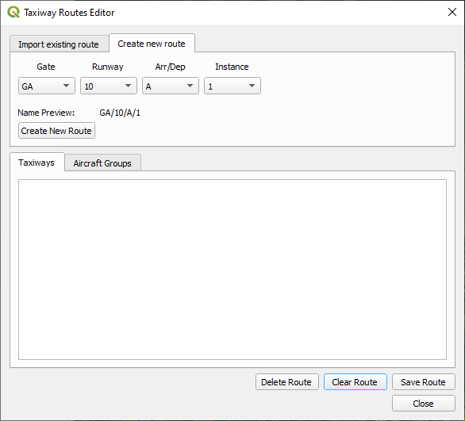
  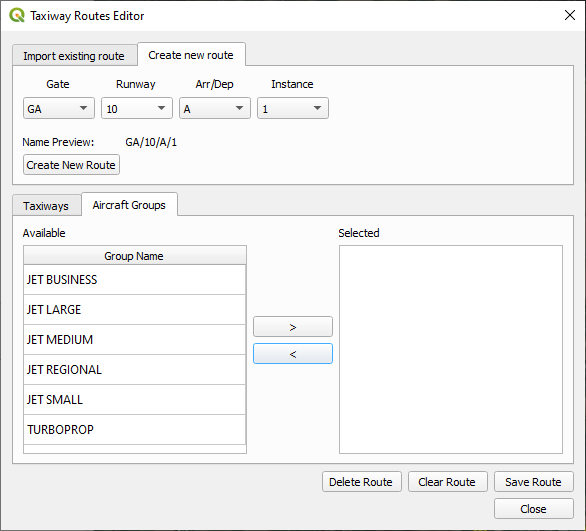
</p>

To define a taxi route in OpenALAQS, the user has to first create the taxi-route by selecting the gate, runway and operation type (arrival or departure). More than one taxi-route can be defined for the same combination of gate, runway and operation type, using a different instance number. Once defined, the corresponding taxiway segments have to be selected together with the aircraft groups that can make use of the specific taxi-route.

### [Create output file](#create-output-file)

Before calculating emissions, the user must generate an OpenALAQS file that includes all user-defined elements of the study (e.g., emission sources) and the default internal database (e.g., emission factors).

The corresponding interface allows the user to set the path for saving the output file, select movements and meteorological data, optionally provide an ADS-B file, set time filters, and define the domain and its spatial resolution:
+ **Emission Inventory Output**:
  + **Directory**: The path (directory) to the output file
  + **File Name**: The name of the output file to be generated
+ **Movement Data**:
  + **Movements Table**: A placeholder to select the table containing data about aircraft movements
  + **Filter Start Date**: A date selector to filter the movement data by a specific start date
  + **Filter End Date**: A date selector to filter the movement data by a specific end date
+ **ADS-B Data (Optional)**:
  + **ADS-B Table**: A placeholder to select a CSV file with ADS-B trajectory data. When provided, the file is validated on selection and a status line below the field indicates whether the file is valid, the number of flights detected, and any warnings. ADS-B trajectories override the corresponding standard ANP profile for movements whose `profile_id` references a `course = CUSTOM` entry in `default_aircraft_profiles`. See [Movements table](#movements-table) and the [`Auxiliary Material`](AUXILIARY_MATERIAL.md#aircraft-trajectories) for the relationship between the ADS-B file and the movement records.
+ **Meteorological Data**:
  + **Meteorological Table**: A placeholder for importing meteorological data
+ **Modeled Domain**:
  + **X Resolution**: The spatial resolution in the X-axis, set by default to 250 meters and split into 50 cells.
  + **Y Resolution**: The spatial resolution in the Y-axis, also set by default to 250 meters with 50 cells.
  + **Z Resolution**: The vertical spatial resolution, set by default to 50 meters with 20 cells.

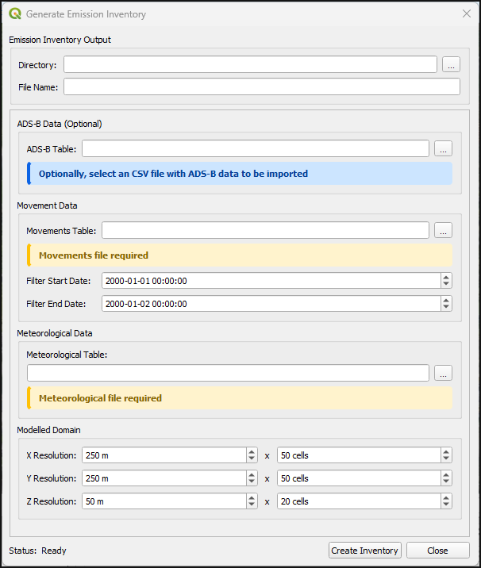

The user must provide a comma-delimited `.csv` file containing aircraft operations (see [`Movements table`](#movements-table)). An automatic check is performed to ensure that all fields in the movements and meteorology files are in the correct format (e.g., dates should follow the format YYYY-MM-DD HH:MM:SS). The meteorology file is optional; if it is missing or contains invalid data, default values based on ISA conditions will be used.

The optional ADS-B file is also a comma-delimited `.csv`. The validator (`open_alaqs/core/tools/ads_b.py`) checks the columns below; any other columns in the CSV are passed through unchanged.

| Field | Type / Unit | Required | Notes |
|---|---|---|---|
| `flight_id` | text | yes | Groups rows belonging to one flight. |
| `latitude` | degrees, WGS84 | yes | |
| `longitude` | degrees, WGS84 | yes | |
| `altitude` | feet | yes | |
| `tas` | knots | yes | True airspeed. |
| `power_setting` | fraction 0–1 | one of `power_setting` or `fuel_flow` per row | Engine power setting fraction used by the BFFM2 twin-quadratic fit. The legacy column name `thrust` is accepted as an alias for old files; values are still treated as a fraction. |
| `fuel_flow` | kg/s, aircraft total | one of `power_setting` or `fuel_flow` per row | Total-aircraft ambient fuel flow. Divided by the engine count before BFFM2 dispatch. |
| `timestamp` | YYYY-MM-DD HH:MM:SS | optional | Read for human readability only; flight time is taken from the movement table's `runway_time` / `block_time` matched by `profile_id`. |

> **Note:** Ground taxi emissions are handled separately via taxiway routes. ADS-B rows during ground taxi should not be included in this CSV — they would otherwise be imported as flight-trajectory points at zero altitude.

> **Note:** All movements in a study share a single ambient condition record from the meteorological table. OpenALAQS does not model temporal variation in ambient conditions across the study period.

### [Movements table](#movements-table)

This table contains all the aircraft movements occurring at the airport during a certain period. It must include the following mandatory fields:

| Field | Description |
|---|---|
| `runway_time` | Date and time of arrival at the runway (YYYY-MM-DD HH:MM:SS) |
| `block_time` | Date and time of arrival at the gate (YYYY-MM-DD HH:MM:SS) |
| `aircraft` | ICAO aircraft type designator |
| `gate` | Stand used for the aircraft operation |
| `departure_arrival` | Type of operation (A = arrival, D = departure) |
| `runway` | Name of the runway used |
| `taxi_route` | Name of the taxi route used |
| `apu_code` | APU usage control — see table below |
| `gate_emissions_code` | Gate emission control — see table below |

**`apu_code` values:**

| Code | Meaning |
|---|---|
| −1 or 0 | No APU emissions (default when field is empty) |
| 1 | APU running at gate/stand only |
| 2 | APU running during full taxi |

**`gate_emissions_code` values:**

| Code | Meaning |
|---|---|
| 0 | Suppress all gate emissions (GSE, GPU, and MES) for this movement |
| 1 | Include all gate emissions (default) |

The following optional parameters can be left empty. They will only be used if the user provides specific values; otherwise default values from the internal database will be used.

| Field | Description | Status |
|---|---|---|
| `engine_name` | Engine identifier (from the internal database) | Active |
| `profile_id` | Performance profile identifier. Standard ANP profiles use `course = ANP2.x`. ADS-B-derived profiles use `course = CUSTOM` with East/North coordinate offsets and an optional `fuel_flow_kgm` column for BFFM2. | Active |
| `track_id` | Aircraft trajectory identifier | `not yet fully implemented` |
| `tow_ratio` | Take-off gross weight divided by maximum take-off weight (≤ 1.0). Applied only when **Apply NOx Corrections** is enabled (Bymode method only). Default: 1.0. | Active (Bymode + NOx corrections only) |
| `taxi_engine_count` | Number of engines used during taxiing (single-engine taxi). Used together with the MES timing fields. | Active |
| `set_time_of_main_engine_start_after_block_off_in_s` | Duration in seconds after block-off during which single-engine taxi applies (departure). Takes priority over `_before_takeoff` if both are set. | Active |
| `set_time_of_main_engine_start_before_takeoff_in_s` | Duration in seconds before takeoff at which the remaining engines are started (departure). Used when `_after_block_off` is not set. | Active |
| `set_time_of_main_engine_off_after_runway_exit_in_s` | Duration in seconds after runway exit during which full-engine taxi applies before engines are cut (arrival). | Active |
| `engine_thrust_level_for_taxiing` | Taxi thrust level as a fraction (ICAO default: 0.07 = 7%). Only affects the BFFM2 emission index for the moving taxi phase; queuing always uses true idle (7%) regardless of this setting. | Active |
| `taxi_fuel_ratio` | Ratio between actual fuel flow and idle fuel flow during taxi. Acts as a direct multiplier on taxi segment emissions. Default: 1.0. | Active |
| `number_of_stop_and_gos` | Number of stop-and-go events during taxiing. Each event is modelled as two phases: 21 s at idle (deceleration + hold, per ECAC Doc 29 Vol. 2 Appendix B) plus 11 s at ~15% thrust (acceleration). | Active |

### [Helicopters (FOCA 2015)](#helicopters-foca-2015)

Helicopter movements share the Movements table format described above; the only operational difference is that the `aircraft` field carries an ICAO type designator that resolves against the helicopter catalog (`default_helicopter`) rather than the fixed-wing catalog (`default_aircraft`). At calculation time the plugin checks both catalogs for each ICAO; rows in `default_helicopter` are routed through the FOCA 2015 emission methodology and the dedicated helicopter trajectory generator. No flag in the Movements table marks a row as a helicopter — the lookup result determines dispatch.

**FOCA 2015 method.** The reference is Rindlisbacher T., Chabbey L., "Guidance on the Determination of Helicopter Emissions", Swiss Federal Office of Civil Aviation, Edition 2, December 2015 (Ref: COO.2207.111.2.2015750). Emissions are computed live from each helicopter's engine type, maximum shaft horsepower, engine count, and category; no precomputed emission indices are stored. The implementation is independent of the **Method** selection on the Configuration tab (ByMode / BFFM2): both fixed-wing methods invoke the same FOCA path for helicopters.

**Helicopter category.** Each movement is classified at runtime into one of four FOCA categories using engine type, engine count, and MTOM. The classification is not stored in the table:

| Category | Rule |
|---|---|
| `PISTON` | `engine_type = PISTON` |
| `SINGLE_TURBOSHAFT` | `engine_type = TURBOSHAFT`, `engine_count = 1` |
| `TWIN_TURBOSHAFT_LIGHT` | `engine_type = TURBOSHAFT`, `engine_count ≥ 2`, MTOM ≤ 3400 kg |
| `TWIN_TURBOSHAFT_HEAVY` | `engine_type = TURBOSHAFT`, `engine_count ≥ 2`, MTOM > 3400 kg |

The 3400 kg threshold is defined in FOCA 2015 section 2.4. The category drives both the emission formulas and the trajectory geometry; the per-category trajectory parameters and their citations are documented in [`TRAJECTORY_DATA_SOURCES.md`](TRAJECTORY_DATA_SOURCES.md).

**Default catalog.** 60 helicopter rows in `default_helicopter` covering common types (R22, A109, EC135, AS332, S76, S92, etc.). 86 engine rows in `default_helicopter_engines` covering the corresponding turboshaft and piston engines. The columns are:

| Table | Field | Notes |
|---|---|---|
| `default_helicopter` | `icao` | ICAO type designator |
| | `variant_label` | Disambiguates multiple rows per ICAO (e.g. `A109E_POWER` vs `A109II`). Composite logical key is `(icao, variant_label)`. |
| | `manufacturer`, `name` | Free text |
| | `mtow_kg` | Maximum take-off weight in kilograms (used for category derivation) |
| | `engine_count` | Number of engines (used for category derivation) |
| | `engine`, `engine_name` | References a row in `default_helicopter_engines` |
| | `max_shp_per_engine` | Maximum shaft horsepower per engine |
| | `is_default` | `1` if this is the default variant for the ICAO when the Movements table does not specify a `variant_label` |
| `default_helicopter_engines` | `engine_name` | Logical key |
| | `engine_full_name` | Free text |
| | `engine_type` | `PISTON` or `TURBOSHAFT` |
| | `max_shp_per_engine` | Fallback if the helicopter row does not override |
| | `source` | Provenance citation |

To add a helicopter type that is not in the default catalog, insert a row into `default_helicopter` referencing an existing engine in `default_helicopter_engines` (or insert a new engine row first). The minimum fields are `icao`, `variant_label`, `mtow_kg`, `engine_count`, `engine`, `engine_name`, `max_shp_per_engine`, `is_default`. Once the row is in place, any movement whose `aircraft` field matches that ICAO will be routed through the FOCA path automatically.

**What is suppressed for helicopters.** APU emissions and gate emissions are skipped at the dispatch level regardless of the movement table's `apu_code` and `gate_emissions_code` values. The FOCA 2015 LTO cycle covers all of ground idle, takeoff, climb-out, approach, and landing on its own, so APU and GSE / GPU / MES emissions are not double-counted. Taxi emissions are handled by the fixed-wing taxi route logic; helicopters typically taxi minimally (ground idle on the spot or air-taxi).

**Limitations.** The 3000 ft AGL LTO ceiling is per the ICAO LTO definition; emissions above that altitude are not modelled. Two known FOCA 2015 PDF inconsistencies were resolved during implementation (piston fuel-flow leading coefficient and twin-heavy Appendix C power settings) and are recorded in the docstring of `open_alaqs/core/tools/foca_heli.py`.

### [Meteorology](#meteorology)

OpenALAQS requires meteorological data to accurately calculate emissions using advanced methods (e.g. BFFM2, correction of NOx for ambient conditions) and for the dispersion calculation.

The required meteorological parameters are:

| Parameter | Unit | Notes |
|---|---|---|
| `Scenario` | — | Simulation name identifier |
| `DateTime` | YYYY-MM-DD HH:MM:SS | |
| `Temperature` | K | |
| `Humidity` | kg water / kg dry air | Used directly if non-zero; takes priority over `RelativeHumidity` |
| `RelativeHumidity` | % | Used to derive specific humidity if `Humidity` is zero or empty |
| `SeaLevelPressure` | Pa | |
| `WindSpeed` | m/s | |
| `WindDirection` | degrees | |
| `ObukhovLength` | m | |
| `MixingHeight` | m | Also used as the LTO ceiling in the emission calculator (default 914.4 m). Should match the **Vertical Limit** set on the **Configuration** tab when generating the inventory. |

If `Humidity` (specific humidity in kg/kg) is populated and non-zero, it is used directly. If it is empty or zero, specific humidity is derived from `RelativeHumidity`, `Temperature`, and `SeaLevelPressure`. When both fields are populated, `Humidity` takes precedence.

Input data may come from local or national data providers (e.g., METAR, SYNOP) or reanalysis data. If the meteorology file is missing or contains invalid data, default ISA conditions are used.

## [Calculate emissions and query results](#calculate-emissions-and-query-results)
[(Back to top)](#table-of-contents)

To calculate emissions and visualize the results, click the `Visualize Emission Calculation` button in the OpenALAQS toolbar. A new window will appear, allowing you to browse all source types and names. Emissions from aircraft-related sources (gates, taxiways and runways) are grouped together under the name `MovementSource`.

In the settings panel on the bottom left of the main window, the user can configure the calculation settings, the output formats and the settings for the dispersion model.

In the **Configuration** tab, the user can specify the general settings for the emissions calculation:
+ **Start (incl.)** / **End (incl.)**: Define the emission calculation period (_optional_)
+ **Method**: Select the calculation method — `ByMode` or `BFFM2`. See below for a description of each.
+ **Apply NOx Corrections**: Applies the ICCAIA NOx correction for ambient temperature, humidity, and aircraft weight (via `tow_ratio`). **This option must only be used with the ByMode method.** Enabling it together with BFFM2 double-corrects ambient NOx, because BFFM2 already applies its own ambient correction internally.
+ **Source Dynamics**: Select source dynamics method (_set to "none" by default_)
+ **Time Interval**: Set the time interval for the calculation (_1 hour by default_)
+ **Vertical Limit**: Specify the vertical limit in meters (_914.40 m by default_)
+ **Receptor Points**: Specify receptor points using a `.csv` file (_optional_)

**Calculation methods:**

| Method | Description |
|---|---|
| **ByMode** | Uses ICAO EEDB emission indices for each LTO mode (TO, CL, AP, TX) directly, based on the time-in-mode from the movement profile. Simple and fast. |
| **BFFM2** | Boeing Fuel Flow Method 2. Uses the actual power setting from each profile segment to derive a fuel-flow-dependent emission index via log-log interpolation through the four EEDB breakpoints. Applies ambient corrections for temperature, pressure, and humidity. Typically gives 20–50% lower NOx and 15–30% higher CO for arrivals compared to ByMode. See [`BFFM2.md`](documents/BFFM2_validation/BFFM2.md) for the full methodology. |

After changing the calculation method, click **Calculate** again before exporting results.

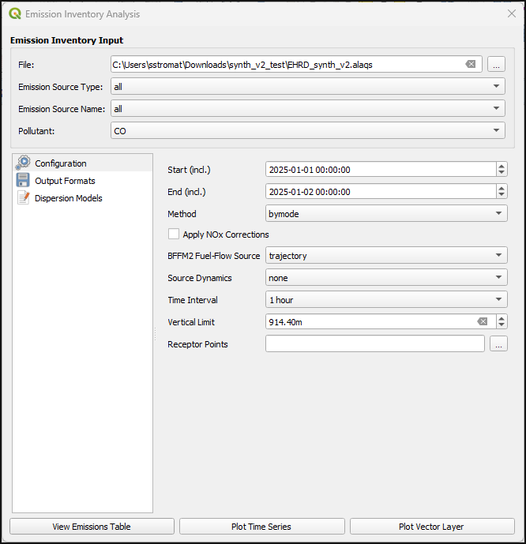

### [PM10 output columns](#pm10-output-columns)

The emission output CSV contains the following PM-related columns for aircraft movements:

| Column | Contents |
|---|---|
| `pm10_kg` | Total PM10 = combustion PM10 + brake wear (arrivals only) |
| `pm10_nonvol_kg` | Non-volatile PM (nvPM mass), MEEM V1 ambient-corrected where 5-point EEDB data are available |
| `pm10_sul_kg` | Sulphate vPM = 36.75 mg/kg × fuel burned (FSC 500 ppm, ε = 0.024, CAEP14 default) |
| `pm10_organic_kg` | Organic vPM = δ_k × HC_EI × fuel burned |
| `p1_kg` | PM1.0 placeholder; currently equal to `pm10_kg` |
| `p2_kg` | PM2.5 placeholder; currently equal to `pm10_kg` |

For departure movements, `pm10_kg = pm10_nonvol_kg + pm10_sul_kg + pm10_organic_kg` exactly. For arrivals, `pm10_kg` additionally includes a brake-wear contribution per the FOA3 formula (`MTOW × 0.000476 − 8.74` grams), visible as a surplus over the sub-component sum on the first taxi segment. `p1_kg` and `p2_kg` include brake wear and equal `pm10_kg` for all movements. Detailed information on the PM10 breakdown methodology is in the [`Auxiliary Material`](AUXILIARY_MATERIAL.md#pm10-breakdown).

In the **Output Formats** tab:
+ **Emissions table**: Output view type (by aggregation, by source or by grid cell)
+ **Time Series**: Define x-axis title, marker and receptor points
+ **Vector Layer**: Settings for visualisation of results on a grid

In the **Dispersion Models** tab, the user can specify general settings for the dispersion model (see [`Dispersion modeling with AUSTAL`](#dispersion-modeling-with-austal)).

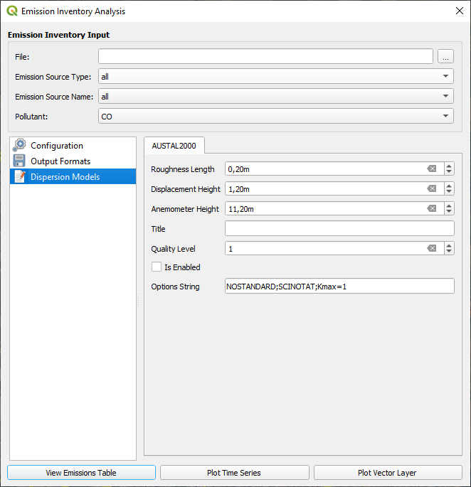

There are three ways to visualize calculated emissions:
+ View results in table format (`View Emissions Table`)
+ View results as a time series (`Plot Time Series`)
+ Visualize results on a grid (`Plot Vector Layer`)

## [Dispersion modeling with AUSTAL](#dispersion-modeling-with-austal)
[(Back to top)](#table-of-contents)

The connection of OpenALAQS with AUSTAL was realized based on the existing architecture of the OpenALAQS code. In order to retain the flexibility of OpenALAQS, two new modules were developed: one for producing the input files for the dispersion model and a second for running AUSTAL and exploring the calculated concentrations.

### [Input data](#input-data)

The dispersion module will only be activated if the `Is Enabled` checkbox is checked. By default, this checkbox is unchecked.

The following parameters need to be defined:
+ **Roughness Length**: Height above ground where wind speed theoretically becomes zero. Depends on terrain type (e.g., forests, urban areas, flat fields).
+ **Displacement Height**: Height at which the wind profile starts to be affected by obstacles on the ground, such as buildings or trees.
+ **Anemometer Height**: Height at which wind speed measurements are taken. Default: 10 m.
+ **Quality Level**: Determines the number of simulation particles (range: −4 to +4). Higher values increase accuracy but also computation time.
+ **NOTALUFT** (per-hour series): when enabled, AUSTAL writes per-hour grid output (`<substance>-NNNa.dmna`) and, when receptor points are configured, per-receptor time-series files (`<substance>-tmpa.dmna`). Required for **Plot Time Series** and **Compliance Report**; optional for **Plot Vector Layer** with `annual mean`.
+ **PM10 fine fraction**: how PM10 emissions are split between AUSTAL's `pm-1` and `pm-2` substances (default 0.9, suitable for an airport mix dominated by aircraft non-volatile PM and combustion exhaust).
+ **Receptor Points**: Specify receptor points using a `.csv` file. In ALAQS mode the plugin will also auto-load any receptors defined in the `shapes_receptor_points` table of the `.alaqs` file if no CSV is given. Without receptors AUSTAL still produces grid output, but Plot Time Series and Compliance Report stay disabled.
+ **Options String**:
  + `NOSTANDARD`: Activates non-standard calculation configurations.
  + `SCINOTAT`: Forces output in scientific notation with four significant decimal places.
  + `Kmax=1`: Limits the simulation to near-ground (surface-level) calculations.

The necessary input files for a simulation with AUSTAL are:
+ **austal.txt**: Contains all main input parameters.
+ **series.dmna**: Time series of meteorological parameters (wind direction, wind speed, Obukhov length) as subsequent hourly means for an integer number of days.
+ **grid file** (e\*\*\*\*.dmna): Emission data on a three-dimensional grid.

The user is referred to the [`AUSTAL`](https://www.umweltbundesamt.de/en/topics/air/air-quality-control-in-europe/download) documentation for more information on the input parameters and data files.

### [Running AUSTAL](#running-austal)

Click `Calculate Dispersion` in the OpenALAQS toolbar to open the dispersion dialog. The dialog has five sections, worked through in order:

1. **AUSTAL Executable** — file-pick the path to `austal.exe` (Windows) or `austal` (Linux). One-time per machine.
2. **Input File Strategy** — pick one of three radio buttons:
   + `Use Existing AUSTAL Input Files` — run AUSTAL against a folder you already prepared.
   + `Generate AUSTAL Input Files from OpenALAQS Emission Inventory File` — drive the run from an `*_out.alaqs` file (most common path).
   + `Generate AUSTAL Input Files from CSV` — drive the run from emissions and meteo CSV files prepared outside OpenALAQS.

   In the two Generate modes, set the **Work Directory** where the input files (`austal.txt`, `series.dmna`, etc.) and AUSTAL's outputs will be written. The same section also exposes the **Receptors CSV** picker, the **NOTALUFT** checkbox, and the **PM10 fine fraction** spinbox (described above). For Generate-from-`.alaqs`, the plugin auto-loads receptor points from the `shapes_receptor_points` table if the Receptors CSV picker is empty.

3. **Execution** — click `Run AUSTAL`. The optional `Erase Log File at the Start of the Calculation` checkbox deletes any existing `austal.log` before the run.
4. **Result Visualisation** — populated after a successful run. See [Visualize results](#visualize-results) below.

AUSTAL can also be run independently outside OpenALAQS. For a step-by-step operational walkthrough, see [`documents/AUSTAL/AUSTAL_OPERATION.md`](./AUSTAL/AUSTAL_OPERATION.md).

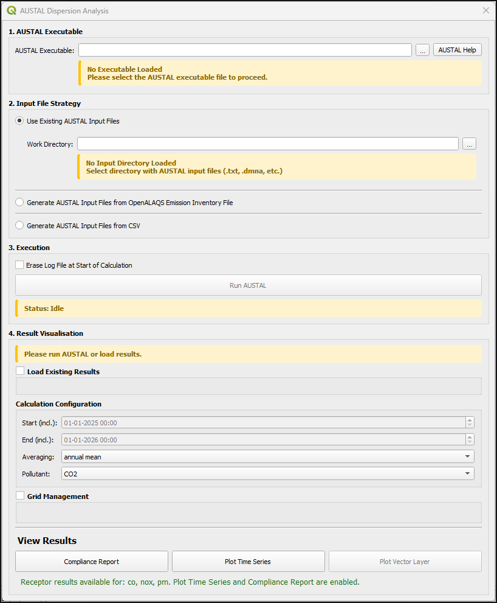

By default, a file named `austal.log` is generated at the end of the dispersion calculation. Option `Erase Log File at the Start of the Calculation` deletes any existing log file before the calculation.

### [Output data](#output-data)

AUSTAL calculates substance-specific annual means and, when run with NOTALUFT, also per-hour means (used by the plugin to derive daily / hourly / 8-hour aggregates and per-receptor time series).

| File pattern | When written | Read by |
|---|---|---|
| `<substance>-y00a.dmna` | Always | Plot Vector Layer (annual mean) |
| `<substance>-NNNa.dmna` | NOTALUFT enabled | Plot Vector Layer (hourly / 8-hour mean) |
| `<substance>-tmpa.dmna` | NOTALUFT + receptors | Plot Time Series, Compliance Report |
| `<substance>-y00s.dmna` | Always | Statistical uncertainty companion to `y00a` |

For example, the annual-mean concentration for HC is `hc-y00a.dmna` ('00' refers to the grid; 'a' refers to additional load). The statistical uncertainty is in `hc-y00s.dmna`. Concentrations are in micrograms per cubic metre.

By default, the concentration file only contains the ground layer (K=1). Using the `NOSTANDARD` option, more layers can be written out (e.g. `NOSTANDARD;Kmax=3` in `austal.txt`).

The plugin's substance codes follow AUSTAL convention: `pm` for PM10 (which AUSTAL internally splits into `pm-1` and `pm-2`), `pm25` for PM2.5, lowercase enum value for the rest.

### [Visualize results](#visualize-results)

After a successful AUSTAL run, three result modules are available under the **View Results** section:

+ **Plot Vector Layer** — spatial concentration map on the AUSTAL grid. The averaging combo selects which `.dmna` file is read: `annual mean` always works; `hourly` and `8-hours mean` require NOTALUFT.
+ **Plot Time Series** — concentration vs time at a chosen receptor point, with smoothing combo (raw / 1h / 8h / 24h / 7d), navigation toolbar, and CSV export. Requires NOTALUFT + receptors.
+ **Compliance Report** — per-receptor PASS/FAIL evaluation against EU Directive 2024/2881 limit values applicable from 1 January 2030 (PM10, PM2.5, NO2, NOx ecosystem, SO2). Each row reports value, threshold, allowed exceedances, and PASS/FAIL with colour coding. CSV export available. Requires NOTALUFT + receptors.

The status label below the buttons lists which substances have receptor data available, or names the missing piece (no receptors / no NOTALUFT / no AUSTAL output yet) when a button is disabled. Each button's tooltip gives the exact 3-step recipe.


