# Open-ALAQS User Guide

## Table of Contents
- [Open-ALAQS User Guide](#open-alaqs-user-guide)
  - [Table of contents](#table-of-contents)
  - [Introduction](#introduction)
    - [General Information](#general-information)
    - [Installation](#installation)
  - [The Open-ALAQS Toolbar](#the-open-alaqs-toolbar)
  - [Starting a Study](#starting-a-study)
    - [Setup a new study](#setup-a-new-study)
    - [Open an existing study](#open-an-existing-study)
    - [Import OpenStreetMap data](#import-openstreetmap-data)
  - [Define emission sources](#define-emission-sources)
    - [Add Features](#add-features)
    - [Edit Features](#edit-features)
    - [Delete Features](#delete-features)
    - [Visualize and Edit Attribute Values](#visualize-and-edit-attribute-values)
    - [Aircraft related Sources](#aircraft-related-sources)
      - [Gates](#gates)
      - [Runways](#runways)
      - [Taxiways](#taxiways)
      - [Tracks](#tracks)
    - [Stationary Sources](#stationary-sources)
      - [Parking Lots](#parking-lots)
      - [Roadways](#roadways)
      - [Point sources](#point-sources)
      - [Area sources](#area-sources)
      - [Buildings](#buildings)
  - [Activity Profiles](#activity-profiles)
  - [Generate Emissions Inventory](#generate-emissions-inventory)
    - [Taxi routes](#taxi-routes)
    - [Create output file](#create-output-file)
    - [Movements table](#movements-table)
    - [Meteorology](#meteorology)
  - [Calculate emissions and query results](#calculate-emissions-and-query-results)
  - [Dispersion modeling with AUSTAL](#dispersion-modeling-with-austal)
    - [Input data](#input-data)
    - [Running AUSTAL](#running-austal)
    - [Output data](#output-data)
    - [Visualize results](#visualize-results)
- [Auxiliary Material](#auxiliary-material)
  - [Open-ALAQS Database](#open-alaqs-database)
  - [ANP](#anp)
  - [AUSTAL](#austal)
  - [COPERT](#copert)
  - [Smooth and Shift](smooth-and-shift)
- [Test Case Study](#test-case-study)
<!-- [FAQs](#faqs) -->
<!-- [Contact](#contact) -->

## [Introduction](#introduction)
[(Back to top)](#table-of-contents)

Welcome to the **Open-ALAQS** user guide. This document will help you navigate the key features of the software, including setting up a study, emissions & dispersion calculations and exporting results in various formats.

### [General Information](#general-information)

Open-ALAQS is a [EUROCONTROL](https://www.eurocontrol.int/) open-source tool designed to model and analyze emissions from aircraft operations and various airport sources. It can calculate emission inventories, visualize data, and perform dispersion modeling with the help of [AUSTAL](https://www.umweltbundesamt.de/en/topics/air/air-quality-control-in-europe/overview).

It is developed as a plugin for the open-source geographic information system [QGIS](https://qgis.org/), simplifying the definition of various airport elements (such as runways, taxiways, and buildings) and enabling the visualization of the spatial distribution of emissions and concentrations. It is fully based on an open architecture, making it easily adaptable to other GIS platforms and databases.

### [Installation](#installation)

For installation instructions, check the [Installation Instructions](../README.md#installation).

## [The Open-ALAQS Toolbar](#the-open-alaqs-toolbar)
[(Back to top)](#table-of-contents)

The toolbar consists of the following functions:

- **About**: General information about the current Open-ALAQS version.
- **Create Study**: Create a new Open-ALAQS project.
- **Open Study**: Open an existing Open-ALAQS project.
- **Close Study**: Close the current project.
- **Study Setup**: Contains general information about the study.
- **Import OSM Data**: Download and import data from OpenStreetMap (OSM).
- **Profile Editor**: Create activity profiles (hourly, daily, monthly).
- **Routes Editor**: Create taxi routes based on user-defined airport elements (gates, runways, taxiways).
- **Generate Emission Inventory**: Prepares the Open-ALAQS output file containing all study data.
- **Visualize Emissions Calculation**: Manages the emissions calculation, visualization, and export modules.
- **Calculate Dispersion**: Handles the dispersion calculation module.
- **Review Logs**: Opens the log file containing useful information about code execution.

The order of the toolbar buttons generally follows the sequence of steps needed to conduct a study using Open-ALAQS.

## [Starting a Study](#starting-a-study)
[(Back to top)](#table-of-contents)

This section describes the initial steps required to create an Open-ALAQS study.

### [Setup a new study](#setup-a-new-study)
To create a new project, click on the **CREATE** button in the Open-ALAQS toolbar. This action opens a pop-up window named **Create an Open ALAQS project file**, where the user is required to
select a **File name** for saving the new study (**.alaqs**).

After creating a project, the **ALAQS Project Properties** window opens automatically. In this window (tab **Airport**), the user must provide a project name and at least the ICAO code of the airport. The remaining fields (airport name, country, latitude, longitude, etc.) will be automatically filled based on the information in the internal database (see **default_airports.csv**). However, the user can manually edit this default information if needed.

  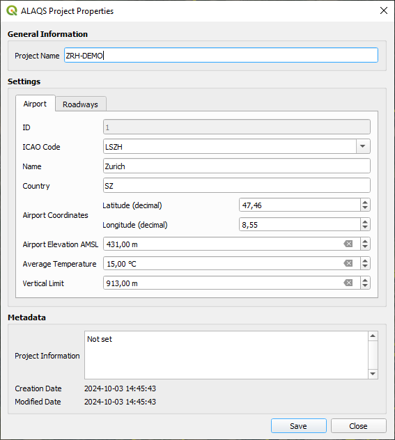
  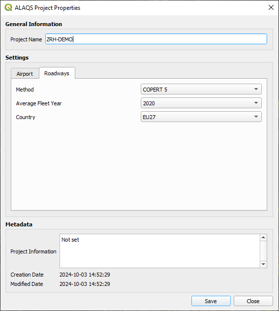

The second tab (**Roadways**) contains the settings for calculating road traffic emissions with [COPERT](#copert). Users are required to specify the average fleet year (values range from 1990 to 2030 in steps of 5) and select a country for country-specific emissions factors(or alternatively EU27). It should be noted that the average fleet year should be viewed as a proxy between the average fleet age and the Euro 1, Euro 2, Euro 3, Euro 4, Euro 5, and Euro 6 vehicle emission standards.

The **ALAQS Project Properties** window, can also be accessed by clicking on the **Setup** button in the Open-ALAQS toolbar.

### [Open an existing study](#open-an-existing-study)
To open a previously created project, click on the **OPEN** button in the Open-ALAQS toolbar. This action opens a pop-up window (**Open an ALAQS database file**), allowing you to select an existing Open-ALAQS database (**.alaqs**) file.

### [Import OpenStreetMap data](#import-openstreetmap-data)
An additional functionality is added to Open-ALAQS to facilitate the creation of emission sources based on the geographic data (roads, buildings, points of interest, and more) provided by OpenStreetMap.

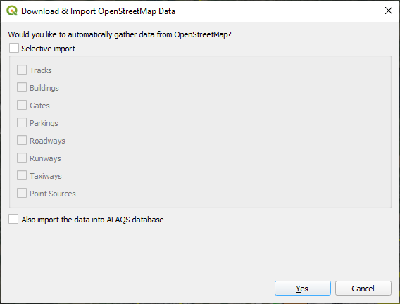

Using Nominatim, a search engine that uses the data from OpenStreetMap to provide geocoding (address to coordinates), directly from the Open-ALAQS toolbar the user can select and import airport related geographical data to the study. The image below illustrates the information that can be collected from OpenStreetMap.

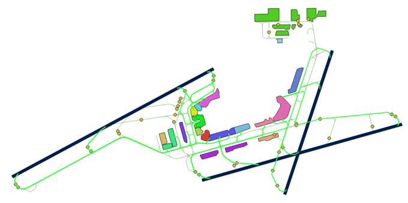

## [Define emission sources](#define-emission-sources)
[(Back to top)](#table-of-contents)

### [Add Features](#add-features)
New objects can be added using the **Digitizing** toolbar.

More information on how to use this toolbar is provided in the [QGIS User Manual](https://docs.qgis.org/3.34/en/docs/user_manual/working_with_vector/editing_geometry_attributes.html#digitizing-an-existing-layer).

To create a new emission source, select the desired layer (e.g., taxiway or runway) to activate it and click **Toggle Editing** in the **Digitizing** toolbar. Then click **Add Feature** to start designing the new feature. Once finished, right click and fill the attribute fields in the pop-up window.

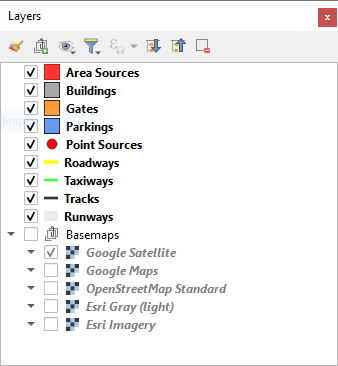

### [Edit Features](#edit-features)
Using the **Digitizing** toolbar in editing mode (**Toggle Editing**), it is possible to employ the **Vertex Tool** to edit objects.

### [Delete Features](#delete-features)
To delete one or more features, first select the geometry using the **Selection** toolbar (_Select Features by area or single click_) and use the **Delete Selected** tool to delete the feature(s). Multiple selected features can be deleted at once. Selection can also be done from the Attributes table.

### [Visualize and Edit Attribute Values](#visualize-and-edit-attribute-values)
Attribute values can also be modified after an object's creation via the **Attributes** toolbar.

The **Open Attribute Table** functionality can be accessed through the **Attributes** toolbar or via the **Layers** panel (by right-clicking on the appropriate layer).

### [Aircraft related Sources](#aircraft-related-sources)
Calculating aircraft emissions requires the definition of three distinct layers: runways, taxiways, gates. For each of these features, the user must provide the required attributes. Defining Tracks (i.e., aircraft trajectories) is also possible; however, this functionnality is not yet fully implemented.

#### [Gates](#gates)
An airport gate refers to a designated location at an airport where aircraft park for boarding and disembarking passengers, loading/unloading cargo, and receiving services like refuelling, catering, and maintenance.

In Open-ALAQS, gates are represented as polygons. Each gate can encompass several aircraft stands. The more stands grouped together within a single gate area, the less data preparation is needed (e.g., fewer taxi routes to define). However, if the gate area is too large, it might no longer accurately represent the location of the emissions.

Calculating gate emissions requires establishing the sum of four emission sources: GSE (Ground Support Equipment), GPU (Ground Power Unit), APU (Auxiliary Power Unit) and MES (Main Engine Start).

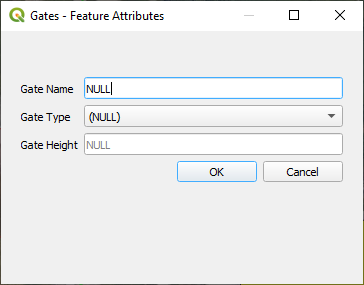

When adding a gate, the following information is required:
+ Gate type (PIER, REMOTE or CARGO)
+ Gate height _not yet fully implemented_

In Open-ALAQS, GSE and GPU emissions factors, expressed in terms of grams of pollutant per hour, is assigned to each gate as a function of:
+ The gate type (PIER, REMOTE or CARGO)
+ The aircraft category (JET BUSINESS/REGIONAL/SMALL/MEDIUM/LARGE,TURBOPROPS,PISTON)
+ The operation type (Arrival or Departure)

The corresponding GSE/GPU emission factors and activity time are included in the Open-ALAQS database (see [default_gate_profiles](./../open_alaqs/database/data/default_gate_profiles.csv)).

APU emissions are calculated separately as a function of the APU model (apu_id) indicated for each aircraft (if available) in the database (see [default_aircraft](./../open_alaqs/database/data/default_aircraft.csv)).

The default APU emission factors and operating times are given in the database files: [default_aircraft_apu_ef](./../open_alaqs/database/data/default_aircraft_apu_ef.csv) and [default_apu_times](./../open_alaqs/database/data/default_apu_times.csv) respectively.

Default MES emission factors per aircraft group are given in the table [default_aircraft_start_ef](./../open_alaqs/database/data/default_aircraft_start_ef.csv).

#### [Runways](#runways)

Runways are linear features that define the vertical plane where approach, landing, take-off, and climb-out operations occur. Each end of the runway is designated as a specific runway, depending on the direction of movement.

When adding a taxiway, the following information is required:
+ Capacity (departures/hour) _not yet fully implemented_
+ Touchdown offset (meters) _not yet fully implemented_
+ Maximum queue speed (km/h) _not yet fully implemented_
+ Peak queue time (minutes) _not yet fully implemented_

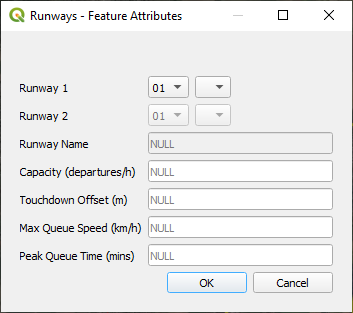

Airport runways are named based on their compass heading, rounded to the nearest 10 degrees. The runway number corresponds to the first two digits of its compass direction. For example, a
runway aligned with 10 degrees is labeled as "01" while one aligned with 190 degrees is labeled "19".

Since runways can be used in both directions, each end has a different number, differing by 18 (180 degrees). For example, a runway labeled "01" on one end will be "19" on the opposite
end. If an airport has parallel runways, they may be further differentiated by letters like "L" (Left), "C"(Center), or "R" (Right).

The runway emissions are calculated based on the aircraft trajectories (profiles) provided in the [Aircraft Noise and Performance (ANP)](https://www.easa.europa.eu/en/domains/environment/policy-support-and-research/aircraft-noise-and-performance-anp-data) database. For more information, see the [ANP](#anp) section.

#### [Taxiways](#taxiways)

An airport taxiway is a designated path that connects runways with terminals, gates, runways or other parts of the airport. When adding a taxiway in an Open-ALAQS study, the following information is mandatory:
+ Name
+ Speed (km/h)

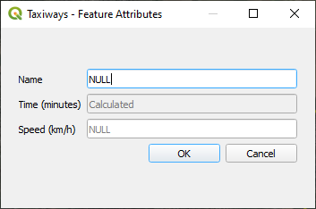

The length of each taxiway is calculated automatically from its geometry and the time spent on it is calculated from the indicated speed and length. Recommended taxiing speeds vary in relation to ambient conditions, traffic, aircraft position on the taxi route etc. Typical taxiing speeds lie between 10 and 40 km/h (~5 and ~25 kts).

It is important to distinguish between taxiways and taxi-routes. Taxi-routes describe the operational path that will be followed by an aircraft for a runway / stand / movement type (arrival or departure) combination. Taxi-routes are defined as a series of taxiway segments in Open-ALAQS. It greatly facilitates the capturing of taxi-route details (such as curved turns) since when defining taxi routes, multiple taxiway segments can be combined.

The process of defining taxi routes is detailed in the [Test Case Study](#test-case-study) section.

#### [Tracks](#tracks)

Aircraft tracks can be designed to indicate the aircraft trajectory. When adding aircraft tracks, the following information is mandatory:
+ Track Name
+ Runway (from the list of previously defined runways)
+ Operation Type (Arrival or Departure)

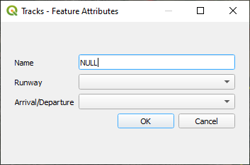

We note that this functionality is _not yet fully implemented_ in Open-ALAQS. The default [ANP](https://www.easa.europa.eu/en/domains/environment/policy-support-and-research/aircraft-noise-and-performance-anp-data) profiles are used to indicate the aircraft trajectories.

### [Stationary Sources](#stationary-sources)
[(Back to top)](#table-of-contents)

For non-aircraft emissions four additional emission sources can be considered: point sources, roadways and parking lots, area sources, buildings. For each feature, the user must input the required attributes.

#### [Parking Lots](#parking-lots)

Emissions from parking areas for vehicles are estimated based on the [COPERT](#copert) methodology.

When adding an airport parking lot, the following information is required:
+ **Parameters**
  + **Number per year**:  Total number of vehicles per year
  + **Height**: Height at which emissions are released (in meters) _not yet fully implemented_
  + **Speed**: Average travel speed in parking (in km/h)
  + **Travel distance**: Average travel distance in parking (in meters)
  + **Idle time**: Vehicle average idling time between entry and exit (in minutes)
  + **Average parking time**: Average time a vehicle remains on parking (in minutes)
+ **Profiles**
  + Hourly, Daily or Monthly activity profiles
+ **Fleet mix**
  + **PC (Petrol) [in %]**: Passenger Cars (Petrol)
  + **PC (Diesel) [in %]**: Passenger Cars (Diesel)
  + **LDV (Petrol) [in %]**: Light Duty Vehicles (Petrol)
  + **LDV (Diesel) [in %]**: Light Duty Vehicles (Diesel)
  + **HDV (Petrol) [in %]**: Heavy Duty Vehicles (Petrol)
  + **HDV (Diesel) [in %]**: Heavy Duty Vehicles (Diesel)
  + **Motorcycles [in %]**
  + **Buses [in %]**

  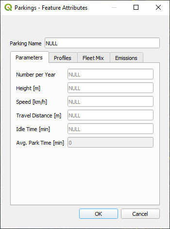
  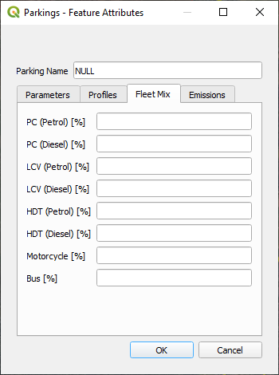
  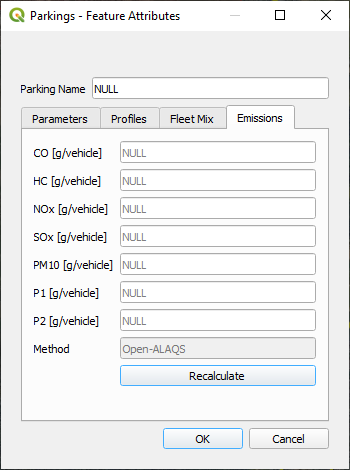

The user should ensure that the fleet mix totals 100% (see the **Fleet Mix** tab). Custom emission factors are calculated (using the **Recalculate** button in the **Emissions** tab) for each parking area using COPERT version 5.4.52, based on the parameters indicated above, as well as the average fleet year and country specified at the beginning of the study setup.

Custom activity profiles can also be defined for each parking area (see [Activity Profiles](#activity-profiles)).

#### [Roadways](#roadways)

Airside or landside emissions are calculated using the same methodology as described above.

When adding a roadway, the following information is required:
+ **Parameters**
  + **Movements per year**: Number of annual movements
  + **Height**: Height at which emissions are released (in meters) _not yet fully implemented_
  + **Speed**: Vehicles speed in roadway (in km/h)
+ **Profiles**:
  + Hourly, Daily or Monthly activity profiles
+ **Fleet mix**
  + **PC (Petrol) [in %]**: Passenger Cars (Petrol)
  + **PC (Diesel) [in %]**: Passenger Cars (Diesel)
  + **LDV (Petrol) [in %]**: Light Duty Vehicles (Petrol)
  + **LDV (Diesel) [in %]**: Light Duty Vehicles (Diesel)
  + **HDV (Petrol) [in %]**: Heavy Duty Vehicles (Petrol)
  + **HDV (Diesel) [in %]**: Heavy Duty Vehicles (Diesel)
  + **Motorcycles [in %]**
  + **Buses [in %]**

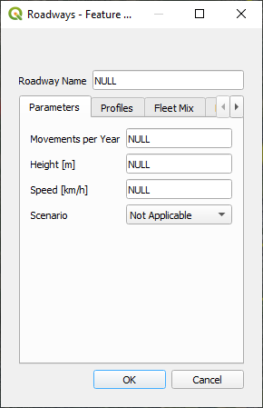

#### [Point sources](#point-sources)

Stationary or infrastructure-related emissions from airport facilities, such as power and heating plants, incinerators, training fires, and fuel storage tanks, are accounted for and represented as point sources in Open-ALAQS.

When adding a point, the following information is required:
+ **Parameters**
  + **Category**: Source category (Tank, Incinerator, Other, Power/Heat plant, Solvent degreaser, Surface coating)
  + **Type**: Category specific type (Oil or diesel, Automobile gasoline, Aviation gasoline, JP4, JP5, JET A)
  + **Height**: Height at which emissions are released (in meters) _not yet fully implemented_
  + **Units per year**: Operating hours per year
+ **Profiles**:
  + Hourly, Daily or Monthly activity profiles

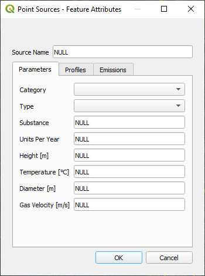

The internal Open-ALAQS database contains default emission factors for each category and type. These values can be modified if more up-to-date information is available to the user (see [default_stationary_ef](./../open_alaqs/database/data/default_stationary_ef.csv)).

The emissions calculation is based on the operating hours per year (**Units per year**) and the corresponding emission factor (in kg/unit). For example, if the number of Units per year is 1 (hour), and the emission factor is equal to 1 kg/unit, the emissions of a single hour will be equal to 1/8760 kg, assuming 8760 hours in a non-leap year (365 days).

#### [Area sources](#area-sources)

This layer allows users to include emissions from custom, user-defined sources not covered by the standard Open-ALAQS sources, as long as they have the relevant emission factor information.

When adding an area source, the following information is required:
+ Parameters:
  + Units per year: Number of operating hours per year
  + Height: Height at which emissions are released (in meters) _not yet fully implemented_
  + Heat Flux: Heat flux (in Megawatts) _not yet fully implemented_
+ Emissions: Emission factors for CO, HC, NOX, SOX, PM10 (in kg/unit)
+ Profiles: Hourly, Daily or Monthly activity profiles (default or custom)

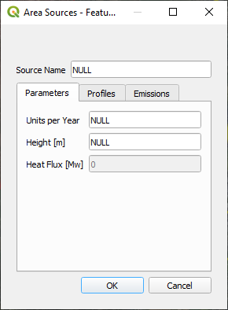

The emissions calculation is based on the operating hours per year (**Units per year**) and the corresponding emission factor (in kg/unit). For example, if the number of Units per year is 1 (hour), and the emission factor is equal to 1 kg/unit, the emissions of a single hour will be equal to 1/8760 kg, assuming 8760 hours in a non-leap year (365 days).

We note that beyond the standard pollutants, two additional pollutants, P1 and P2, can be defined by the user. Emission factors for these pollutants have to be provided by the user.

#### [Buildings](#buildings)

Buildings are not currently considered emission sources. However, they can significantly impact dispersion modelling by affecting wind patterns and turbulence. While this functionality is _not yet fully implemented_, it is included in the layers list for future use.

When adding a building, the following detail is required:
+ Building height (Height of building above ground, in meters) _not yet fully implemented_

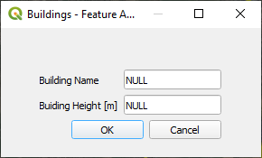

## [Activity Profiles](#activity-profiles)
[(Back to top)](#table-of-contents)

Activity Profiles are used to describe the relative hourly/daily/monthly operational mode for each airport emission source. The **Activity Profiles Editor** in the Open-ALAQS toolbar can be used to review, edit, and create custom profiles.

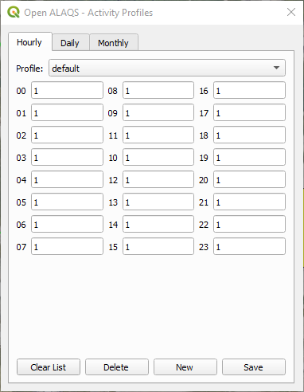

Each activity multiplier is a decimal number, between 0 and 1. The default profile values are 1 (i.e., 100%) meaning the emission source is fully active. On the other hand, if, the emission source is deactivated during a specific time interval (e.g., during night-time curfew) the user can modify accordingly the activity profile by setting the corresponding multiplier to 0 for this specific period (hour, day, or month).

## [Generate Emissions Inventory](#generate-emissions-inventory)
[(Back to top)](#table-of-contents)

This section covers all the necessary steps for preparing an emission inventory using Open-ALAQS.

### [Taxi routes](#taxi-routes)

As explained in the section [Taxiways](#taxiways), taxi-routes describe the operational path of an aircraft between the runway and the gate (or vice versa).

Taxi-routes can be defined using the Taxiway Routes Editor.

  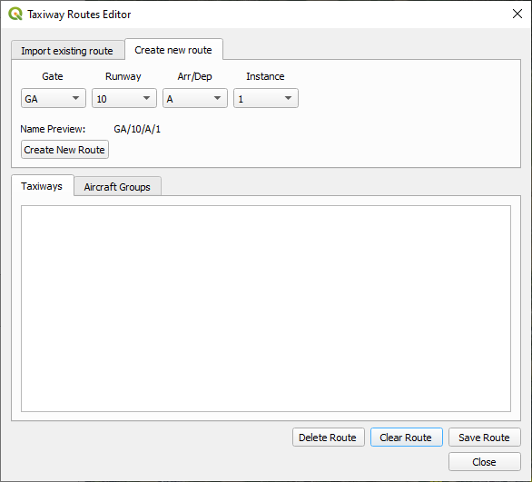
  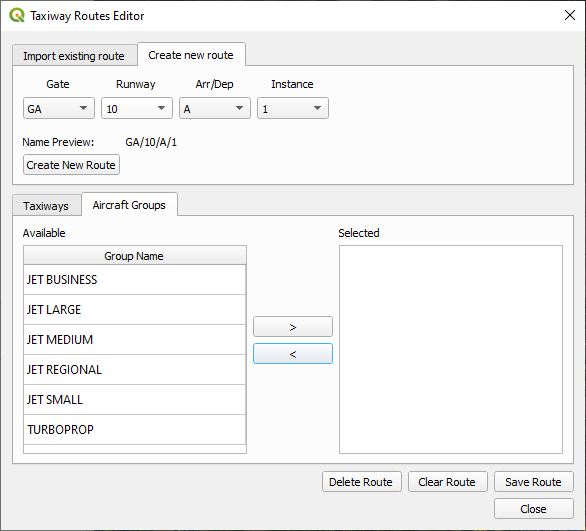

To define a taxi route in Open-ALAQS, the user has to first create the taxi-route by selecting the gate, runway and operation type (arrival or departure). More than one taxi-routes can be defined for the same combination of gate, runway and operation type, using a different instance number. Once defined, the corresponding taxiway segments have to be selected together with the aircraft groups that can make use of the specific taxi-route.

### [Create output file](#create-output-file)

Before calculating emissions, the user must generate an Open-ALAQS file that includes all user-defined elements of the study (e.g., emission sources) and the default internal database (e.g., emission factors).

The corresponding interface allows the user to set the path for saving the output file, select movements and meteorological data, set time filters, define the domain and its spatial resolution and configure other advanced settings:
+ **Emission Inventory Output**:
  + **Directory**: The path (directory) to the output file
  + **File Name**: The name of the output file to be generated
+ **Movement Data**:
  + **Movements Table**: A placeholder to select the table containing data about aircraft movements
  + **Filter Start Date**: A date selector to filter the movement data by a specific start date
  + **Filter End Date**: A date selector to filter the movement data by a specific end date
+ **Meteorological Data**:
  + **Meteorological Table**: A placeholder for importing meteorological data
+ **Modeled Domain**:
  + **X Resolution**: The spatial resolution in the X-axis, set by default to 250 meters and split into 50 cells.
  + **Y Resolution**: The spatial resolution in the Y-axis, also set by default to 250 meters with 50 cells.
  + **Z Resolution**: The vertical spatial resolution, set by default to 50 meters with 20 cells.
+ **Advanced Options**:
  + **Method**: The emission calculation method, currently set to "ALAQS". _not yet fully implemented_
  + **Towing Speed**: A field specifying towing speed, set to 10.00 km/h. _not yet fully implemented_
  + **Vertical Limit**: The vertical extent of the domain, set by default to 914.40 meters, or approximately 3000 feet.

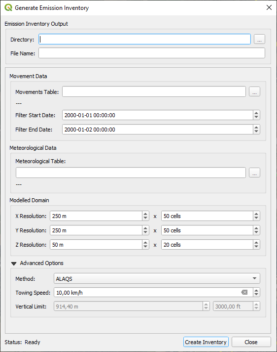

The user must provide a comma-delimited _.csv_ file containing aircraft operations (see [Movements table](#movements-table)). An automatic check is performed to ensure that all fields in the movements and meteorology files are in the correct format (e.g., dates should follow the format YYYY-MM-DD HH:MM:SS). The meteorology file is optional; if it is missing or contains invalid data, default values based on ISA conditions will be used for all necessary meteorological parameters.

We note that the computation time for emissions calculations depends on the size and resolution of the modeled domain.

### [Movements table](#movements-table)

This table contains all the aircraft movements occurring at the airport during a certain period. It must include the following information:
+ **runway_time**: Date and time of arrival at the airport runway (YYYY-MM-DD HH:MM:SS)
+ **block_time**: Date and time of arrival at the gate (YYYY-MM-DD HH:MM:SS)
+ **aircraft**: The ICAO aircraft type
+ **gate**: The stand used for the aircraft operation
+ **departure_arrival**: The type of operation (arrival or departure)
+ **runway**: The name of the runway used for the aircraft operation
+ **taxi_route**: the name of the taxi route used for the aircraft operation
+ **apu_code**: code defining APU usage away from gate/stand (0: APU used at gate only, 1: APU on while taxiing, 2: APU on during taxiing, take-off, climb or approach)

The rest of the parameters are not mandatory and can be left empty. They will only be used if the user provides specific values. Otherwise, the default values from the internal database will be used.

+ **aircraft_registration**: aircraft registration number _not yet fully implemented_
+ **engine_name**: engine name identifier (from the internal database)
+ **profile_id**: performance profile identifier (from the internal database)
+ **track_id**: aircraft trajectory identifier _not yet fully implemented_
+ **tow_ratio**: take-off gross weight divided by maximum take-off weight (float, <=1) _not yet fully implemented_
+ **taxi_engine_count**: number of engines used during taxing (integer)
+ **set_time_of_main_engine_start_after_block_off_in_s**: time spent for MES after leaving the gate (in seconds)
+ **set_time_of_main_engine_start_before_takeoff_in_s**: time spent for MES before take-off (in seconds)
+ **set_time_of_main_engine_off_after_runway_exit_in_s**: time spent for MES after leaving the runway exit (in seconds)
+ **engine_thrust_level_for_taxiing**: taxing thrust level setting (ICAO default: 7%) _not yet fully implemented_
+ **taxi_fuel_ratio**: ratio between actual fuel flow and fuel for the idle mode (float) _not yet fully implemented_
+ **number_of_stop_and_gos**: number of stop and go points during taxing _not yet fully implemented_
+ **domestic**: domestic/international flight (Y or N) _not yet fully implemented_

### [Meteorology](#meteorology)

Open-ALAQS requires certain meteorological data in order to accurately calculate emissions using advanced methods (e.g. BFFM2 method, correction of NOx for ambient conditions) but also for the dispersion calculation.

The required meteorological parameters are:

+ **Scenario**: simulation name identifier
+ **DateTime** (in YYYY-MM-DD HH:MM:SS)
+ **Temperature** (in K)
+ **Humidity** (in kg water/kg dry air)
+ **RelativeHumidity** (in %)
+ **SeaLevelPressure** (in Pa)        
+ **WindSpeed** (in m/s)
+ **WindDirection** (in degrees)
+ **ObukhovLength** (in m)
+ **MixingHeight** (in m)

Input data may come from local or national data providers (e.g. METAR, SYNOP) or reanalysis data. The compilation of the meteorological data file for Open-ALAQS/AUSTAL2000 is left to the user. Otherwise, default ISA conditions values are considered for all necessary meteorological parameters.

## [Calculate emissions and query results](#calculate-emissions-and-query-results)
[(Back to top)](#table-of-contents)

To calculate emissions and visualize the results, click the **Visualize Emission Calculation** button in the Open-ALAQS toolbar. A new window will appear, allowing you to browse all source types and names (whether stationary or aircraft-related). Select the pollutant and the source name (in cases where there are multiple sources of the same type). Emissions from aircraft related sources (gates, taxiways and runways) are grouped together under the name **MovementSource**.

In the settings panel on the bottom left of the main window, the user can configure the calculation settings, the output formats and the settings for the dispersion model.

In the **Configuration** tab, the user can specify the general settings for the emissions calculation:
+ **Start (incl.)**: Define the start date and time of the emission calculation period (_optional_)
+ **End (incl.)**: Define the end date and time of the emission calculation period (_optional_)
+ **Method**: Select the calculation method (**bymode** or **BFFM2**)
+ **Apply NOX Corrections**: A checkbox to apply nitrogen oxide corrections if needed (_optional_)
+ **Source Dynamics**: Select source dynamics method (_set to "none" by default_)
+ **Time Interval**: Set the time interval for the calculation (_set to 1 hour by default_)
+ **Vertical Limit**: Specify the vertical limit in meters (_set to 914.40m by default_)
+ **Receptor Points**: Specify receptor points using a .csv file (_optional_)

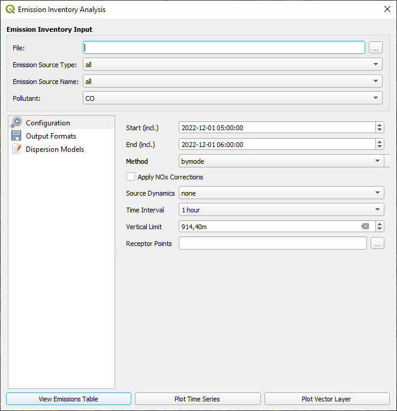

In the **Output Formats** tab, the user can specify the general settings for the visualisation of the results:
+ **Emissions table**: Specify the output view type (_by aggregation, by source or by grid cell_)
+ **Time Series**: Define x-axis title, marker and receptor points (_manually_)
+ **Vector Layer**: Specify settings for visualisation of the results on a grid

In the **Dispersion Models** tab, the user can specify the general settings for the dispersion model:
+ **Roughness Length**: Define roughness length (_set to 0.2m by default_)
+ **Displacement Height**: Define displacement height (_set to 1.2m by default_)
+ **Anemometer Height**: Define anemometer height (_set to 11.2m by default_)
+ **Title**: Define simulation name
+ **Quality Level**:(_set to 1 by default_)
+ **Is Enabled**: Enable or disable dispersion module (checkbox)
+ **Options String**: Define advanced AUSTAL settings

More information on the AUSTAL settings is provided in section [Dispersion modeling with AUSTAL](#dispersion-modeling-with-austal).

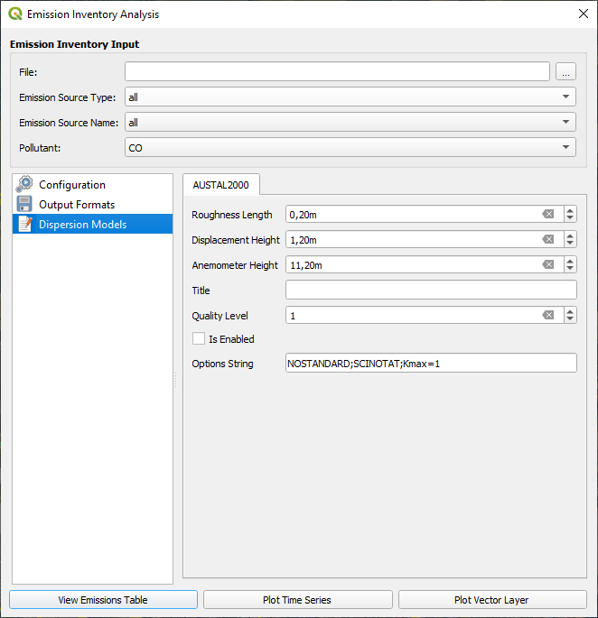

Finally, there are three different ways to visualize the calculated emissions:
+ View the results in a table format (**View Emissions Table**)
+ View the results as a timeseries (**Plot Time Series**)
+ Visualise the results on a grid (**Plot Vector Layer**)

## [Dispersion modeling with AUSTAL](#dispersion-modeling-with-austal)
[(Back to top)](#table-of-contents)

The connection of Open-ALAQS with AUSTAL was realized based on the existing architecture of the Open-ALAQS code. In order to retain the flexibility of Open-ALAQS, two new modules were developed: one for producing the input files for the dispersion model and a second for running AUSTAL and exploring the calculated concentrations. As a result, Open-ALAQS remains independent of the dispersion model and other similar modules can be added in the future.

### [Input data](#input-data)

The process to prepare the input files for AUSTAL is described in the previous section (see [Calculate emissions and query results](#calculate-emissions-and-query-results)).

The dispersion module, along with the preparation of input files for AUSTAL, will only be activated if the corresponding checkbox (**Is Enabled**) is checked. By default, this checkbox is unchecked. Once enabled, the user must select one of the output modules (**View Emissions Table**, **Plot Time Series**, or **Plot Vector Layer**). This procedure saves time, as emissions will be calculated first using the chosen output module. The user can then explore the calculated emissions or proceed to a simulation with AUSTAL.

The following parameters need to be defined:
+ **Roughness Length**: This is a parameter used in atmospheric dispersion modeling to describe the roughness of the surface over which air flows. It represents the height above ground where the wind speed theoretically becomes zero. Roughness length is critical for calculating wind speed profiles and depends on the type of terrain (e.g., forests, urban areas, flat fields). Larger roughness lengths indicate rougher surfaces.
+ **Displacement Height**: Displacement height is the height at which the wind profile starts to be affected by obstacles on the ground, such as buildings or trees. It’s a measure of the "effective" ground level when calculating wind speeds in environments with tall structures or dense vegetation. For example, if buildings or trees occupy a large part of the surface, the wind profile behaves as if the ground is elevated by the displacement height.
+ **Anemometer Height**: This is the height at which wind speed measurements are taken using an anemometer (a device for measuring wind speed). The value of anemometer height is crucial in dispersion models because wind speed profiles vary with height. In the absence of specific measurements, a default height of 10 meters is often used in calculations.
+ **Quality Level**: The quality level determines the number of simulation particles used in dispersion calculations in the AUSTAL model. Increasing the quality level reduces the statistical uncertainty of the results by increasing the number of simulation particles, but it also increases the computational effort and time. The level can range from -4 (lower accuracy, faster computation) to +4 (higher accuracy, slower computation).
+ **Options String**:
  + **NOSTANDARD**: This option in AUSTAL allows the user to deviate from standard settings or procedures. It is used for non-standard calculations, which might involve custom or experimental configurations that differ from the default setup. For example, parameters or methods that require special consideration or testing (e.g., modified wind field models, custom roughness lengths) are activated using this option.
  + **SCINOTAT**: This option forces the output values from the dispersion calculations to be written in scientific notation (exponential format) with four  significant decimal places. This format is especially useful when dealing with very large or very small values, providing more precision and clarity in the results.
  + **Kmax=1**: This parameter sets the maximum number of vertical grid cells (layers) to 1 in the dispersion calculation grid. The **Kmax** option limits the number of vertical layers considered in the simulation, which simplifies the model to near-ground (surface-level) calculations. In practical terms, it restricts the dispersion calculations to focus on ground-level effects without accounting for different vertical layers in the atmosphere.

The necessary input files for a simulation with AUSTAL are:
+ **austal.txt**: Contains all main input parameters, except for time series. Parameters are explained in detail in the program manual. The order of parameters is arbitrary.
+ **series.dmna**: All time-dependent parameter values are specified in this file. It must contain at least the time series of the meteorological parameters wind direction (in degrees against north clockwise), wind speed (in m/s), and Obukhov length (in m) in form of subsequent hourly means for an integer number of days.
+ **grid file** (e*\*\*\*.dmna): Contains the emission data specified on a three-dimensional grid.

The user is referred to the [AUSTAL](https://www.umweltbundesamt.de/en/topics/air/air-quality-control-in-europe/download) documentation for more information on the input parameters and data files.

### [Running AUSTAL](#running-austal)

To launch a simulation with AUSTAL, click **Calculate Dispersion** in the Open-ALAQS toolbar. In the new window that appears, specify the path to the AUSTAL executable and the project directory (**Work Directory**) where all output files will be written. Click **Run AUSTAL** to start the dispersion calculation.

We note that AUSTAL can also be run independently outside Open-ALAQS.

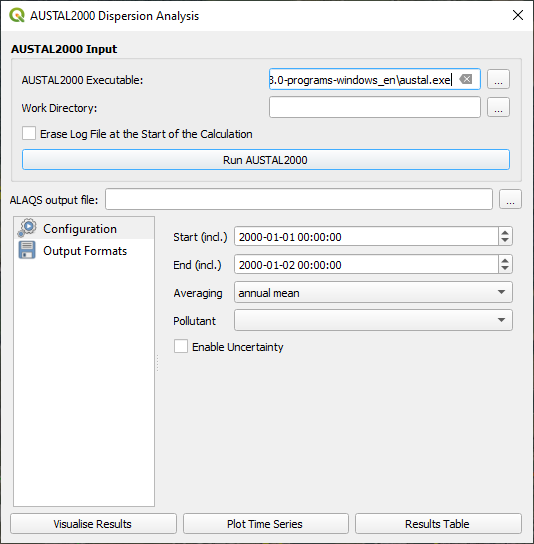

By default, a file named **austal.log** is generated at the end of the dispersion calculation with information on the program, the program run, the applied input data of file **austal.txt**, and a list with the main results of the dispersion calculation. Option **Erase Log File at the Start of the Calculation** deletes any existing log file in the specified directory before the calculation, otherwise log information is appended to the file.

The project directory contains as well **.dmna** files with the concentration distributions near ground for the various characteristic concentration values (annual mean, short-time values). All files are simple text files, their contents can be processed further with any suitable text editor.

### [Output data](#output-data)

AUSTAL calculates the substance-specific annual means and possibly daily or hourly means with a given number of exceedings. More precisely, the annual mean is the mean over the time period defined by the provided file **series.dmna**. In a first step, only the annual mean should be considered. The corresponding file for the pollutant HC for example is hc-y00a.dmna ('00' refers to the grid and will play a role only for nested grids, 'a' refers to additional load). 

The file contains the annual mean concentration for each grid cell of the calculation grid (see **austal.txt**) in microgramm per cubic metre (see file header). The output files can be inspected with any text editor. Importing and creating graphical visualizations using Excel or a GIS system is also straightforward, as the data is organized in a north-oriented matrix.

By default, the concentration file only contains the ground layer (K=1). Using the **NOSTANDARD** option, more layers can be written out (e.g. with the additional input line **NOSTANDARD;Kmax=3** in austal.txt).

The statistical uncertainty of every concentration value is provided in the corresponding file, for example **hc-y00s.dmna**.

### [Visualize results](#visualize-results)

To explore the results of a simulation, the user must select the Open-ALAQS file used for the calculation (to ensure the exact grid and date are applied), and then choose one of the output modules:
+ **Visualise Results** as a vector layer
+ **Plot Time Series** to display results as a time series
+ **Results Table** to view results in table format

The user can specify the general settings for the visualisation of the results from the **Output Formats** tab of the main window.

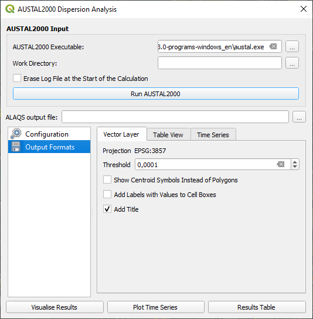

# [Auxiliary Material](#auxiliary-material)
[(Back to top)](#table-of-contents)

## [Open-ALAQS Database](#open-alaqs-database)
[(Back to top)](#table-of-contents)

## [ANP](#anp)
[(Back to top)](#table-of-contents)

## [AUSTAL](#austal)
[(Back to top)](#table-of-contents)

The dispersion model [AUSTAL](https://www.umweltbundesamt.de/en/topics/air/air-quality-control-in-europe/overview) is the reference implementation to Annex 2 of the German Environment Agency’s Technical Instructions on Air Quality Control (TA Luft) and implements the specifications and requirements given therein.

The program is the successor of AUSTAL2000 (which was previously used with Open-ALAQS), the reference implementation to Annex 3 of the TA Luft 2002. AUSTAL and AUSTAL2000 were developed by Janicke Consulting on behalf of the German Environment Agency and are freely available and widely used internationally.

AUSTAL 3.3.0 (released on 22.03.2024) has been developed and tested under Windows and Linux. It is exclusively provided, free of charge under the GNU Public Licence, from the dedicated webpage
of the German Environment Agency.

No installation is needed for use with Open-ALAQS as the executables are already included in the Open-ALAQS package.

## [COPERT](#copert)
[(Back to top)](#table-of-contents)

## [Smooth and Shift](smooth-and-shift)
[(Back to top)](#table-of-contents)

# [Test Case Study](#test-case-study)
[(Back to top)](#table-of-contents)

In this section a test case study is presented. The purpose of this training exercise is to guide the first-time user throughout the main steps of an Open-ALAQS project. This case study is based on fictional data and doesn't represent any actual real-world scenario. All the necessary input files are provided in the [example](./../example/) directory of the Open-ALAQS plugin.
