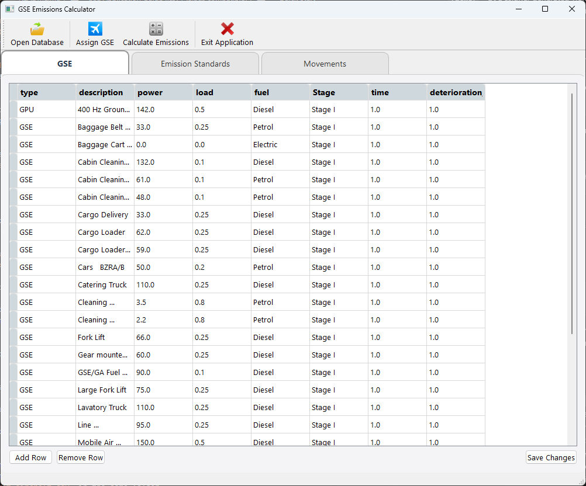
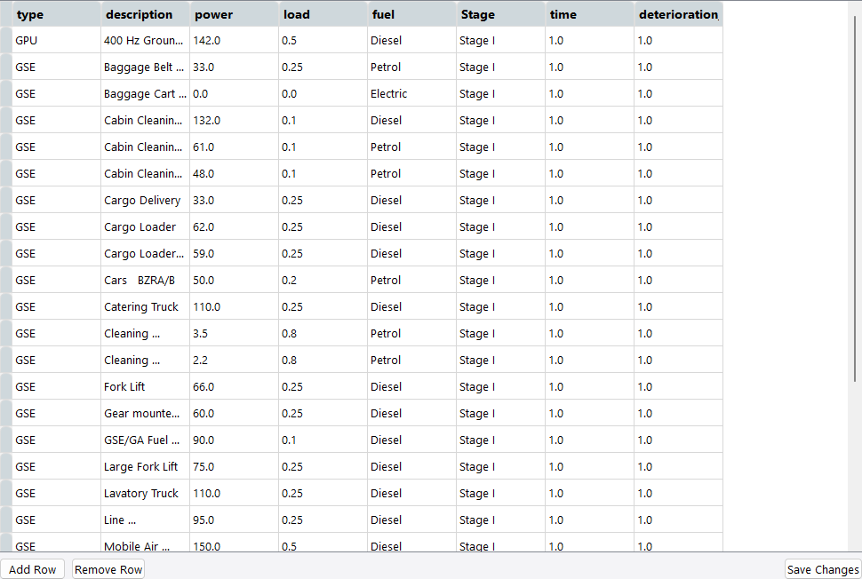
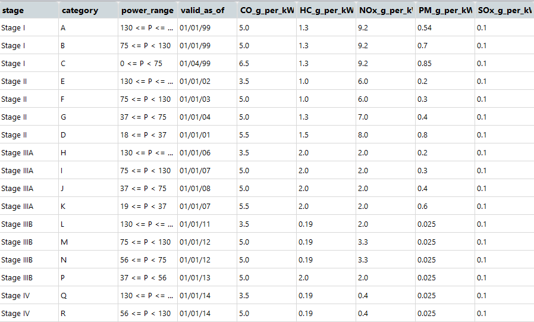
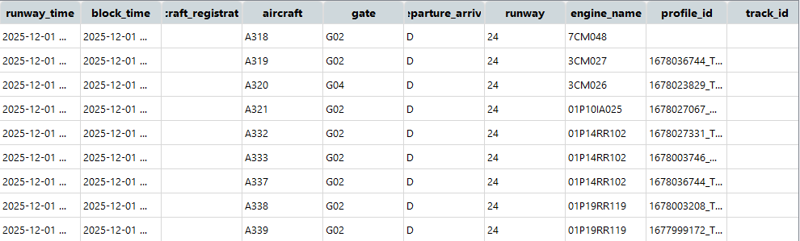
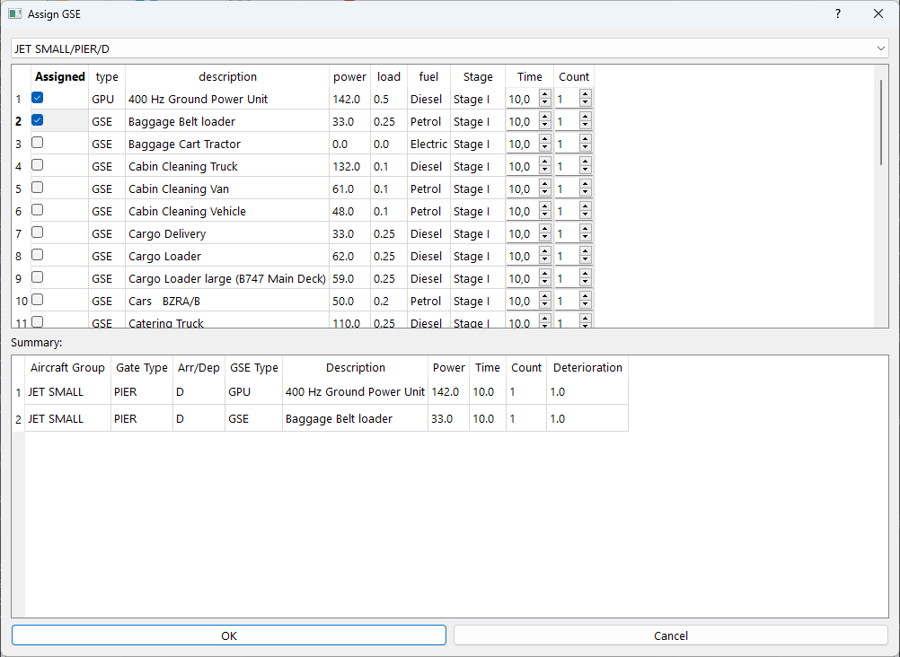
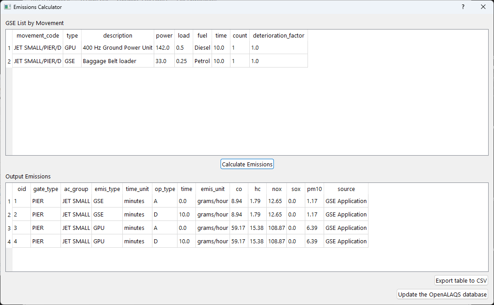

# GSE Application Guide (.csv / .alaqs compatible)


## Table of Contents
- [Table of contents](#table-of-contents)
- [Introduction](#introduction)
  - [OpenALAQS Description](#openalaqs-description)
  - [Key Components](#key-components)
  - [Installation](#installation)
- [Quick Start](#quick-start)
- [User Guide](#user-guide)
  - [Main Tables](#main-tables)
  - [Assign GSE Window](#assign-gse-window)
  - [Emissions Calculator](#emissions-calculator-window)
- [Notes](#notes)
- [Contact/License](#license)


## [Introduction](#introduction)
[(Back to the top)](#table-of-contents)


This folder contains the GSE (Ground Support Equipment) desktop application used to assign GSE to aircraft movements and to calculate emissions which can be exported either as .csv or written back to an OpenALAQS database with the .alaqs extension.

### [OpenALAQS Description](#openalaqs-description)
OpenALAQS is a [`EUROCONTROL`](https://www.eurocontrol.int/) open-source tool designed to model and analyze emissions from aircraft operations and various airport sources. It can calculate emission inventories, visualize data, and perform dispersion modeling with the help of [`AUSTAL`](https://www.umweltbundesamt.de/en/topics/air/air-quality-control-in-europe/overview).

It is developed as a plugin for the open-source geographic information system [`QGIS`](https://qgis.org/), simplifying the definition of various airport elements (such as runways, taxiways, and buildings) and enabling the visualization of the spatial distribution of emissions and concentrations. It is fully based on an open architecture, making it easily adaptable to other GIS platforms and databases.

### [Key Components](#key-components)
- `gse.py` - Main application entry point and UI controller (PyQt5). Loads GSE list, emission standards and movements and exposes the tabs: GSE, Emission Standards and Movements.
- `movement_editor.py` - Dialog to assign GSE to movement categories (ac_group / gate_type / arrival-or-departure). Produces assignment objects used by the calculator.
- `emissions_calculator.py` - Dialog that calculates emissions from assignments and allows export to .csv or update of an OpenALAQS SQLite database table `default_gate_profiles`.
- `views/` - Qt Designer generated views (UI layout files and generated Python modules).
- `model/` - Database abstraction layer used to load/save GSE, emission factors and other resources.

### [Installation](#installation)
1. Create or activate a Python 3 virtual environment and install dependencies:

   ```powershell
   python -m venv .venv; .\.venv\Scripts\Activate.ps1; pip install -r requirements.txt
   ```

   The project relies on PyQt5 and pandas among other packages (see `requirements.txt`).

2. Or install directly the required python dependencies: 

   ```powershell
   pip install -r requirements.txt
   ```

## [Quick Start](#quick-start)
[(Back to the top)](#table-of-contents)

From this folder (i.e. gse_application) run:

  ```powershell
  python gse.py
  ```

The command opens the main window. The application defaults to using .csv backend files (default_gse.csv inside `model/database`), but an OpenALAQS database .alaqs file can be opened via the "Open Database" action button in the UI to work directly against a database backend.



## [User Guide](#user-guide)
[(Back to the top)](#table-of-contents)

This User Guide summarises the main application functionality, purpose and behaviour of each feature.

### [Main Tables](#main-tables)

Below are short descriptions for each main tab/section in the application and what users can do in each one.

- GSE (Ground Support Equipment)

  - Purpose: This table lists the GSE inventory (type, description, power, load factor, fuel and Stage). It is the list used when assigning equipment to movement categories and when calculating emissions.
  - Editing: Rows can be added, removed or modified directly in the GSE tab. Changes are saved back to the existing GSE source (.csv or .alaqs) when the "Save Changes" button is used. The application updates the underlying backends.
  - Validation / checks: The UI performs basic checks to ensure input validity before saving.
  - Behavioural note: Edits are applied to the in-memory model immediately but are only persisted to disk/database when the user presses "Save Changes"; unsaved edits will be lost if the application exits or a different database is opened without saving.

- Emission Standards

  - Purpose: Holds the emission factor definitions used to convert GSE power and operating time into emissions (CO, HC, NOx, PM, SOx). The emission factors include fields like `stage` and `power_range` and per-kWh emission rates (e.g., `CO_g_per_kWh`).
  - How they are used: When calculating emissions the app will match the GSE `Stage` and power range with an emission factor row to compute grams emitted per operation.

- Movements

  - Purpose: Movements data defines which aircraft groups operate at which gate types and whether the movement is an arrival (`A`) or departure (`D`). Calculations aggregate GSE consumption/emissions per movement category (ac_group / gate_type / A|D).
  - Input formats: The application accepts `movements.csv` or `user_aircraft_movements.csv` files (.csv) or reads movements from an OpenALAQS SQLite database table. The key fields required include `aircraft` (or `ac_group`), `gate`, and `departure_arrival` (or a `departure_arrival` equivalent column used by the dataset).
  - Editing: Movements are typically edited outside the application (.csv or .alaqs); however, a new movements .csv can be loaded via the "Open Database" action and then the "Assign GSE" flow can be re-run. The Movement Editor dialog allows assigning GSE per movement code and adjusting time, count and deterioration factor per assignment.

### [Assign GSE Window](#assign-gse-window)

  - Purpose: The Assign GSE window (Movement Editor) presents a list of movement codes (ac_group/gate_type/A|D) and the available GSE list. It allows toggling assignment status and editing the time, count and deterioration factor for each assignment.
  - Reset vs Modify: When existing assignments are present the dialog prompts to either "Reset" (clear previous assignments and start fresh) or "Modify" (keep existing assignments and allow additions/removals). A "Cancel" option aborts the operation.
  - Behaviour: Assignments are stored in-memory in the main application until the dialog is accepted and the assignments are merged into the controller state. The movement summary table shows active assignments and their parameters.

### [Emissions Calculator Window](#emissions-calculator-window)

  - Purpose: The Emissions Calculator computes emissions from the assigned GSE per movement category. The dialog shows the detailed GSE-by-movement list and the calculated output table with columns for CO, HC, NOx, PM and other fields.
  - Export options: Calculation results can be exported to:
    - a new .csv file (via the "Export table to CSV" button), or
    - the currently opened OpenALAQS SQLite database (the dialog will update the `default_gate_profiles` table) when the application was opened from a `.alaqs` / `.db` file.
  - Warnings and save prompts: If calculation results exist and were not exported, closing the Emissions Calculator dialog triggers a prompt asking whether to export the results. The prompt offers exporting to .csv or updating the OpenALAQS DB (if applicable); choosing Cancel leaves the dialog open. If an export is performed successfully the dialog closes automatically.


# [Notes](#notes)
[(Back to the top)](#table-of-contents)
- Movement .csv parsing is defensive: missing or empty files will trigger user-facing warnings. The expected columns are defined in `gse.py` (see `MOVEMENTS_HEADERS`).
- When exporting emissions back to the OpenALAQS DB the code will create `default_gate_profiles` table if missing and will (currently) delete existing rows before inserting the new ones.
- The `doc/GSE-documentation.docx` file contains additional details and user guide material. There a more thorough explanation of inputs, formats and examples can be found.


# [Contact / License](#contact--license)
[(Back to the top)](#table-of-contents)

This code is part of OpenALAQS. See top-level `LICENSE` and `AMENDMENT_TO_EUPL_license.md` for licensing information.


